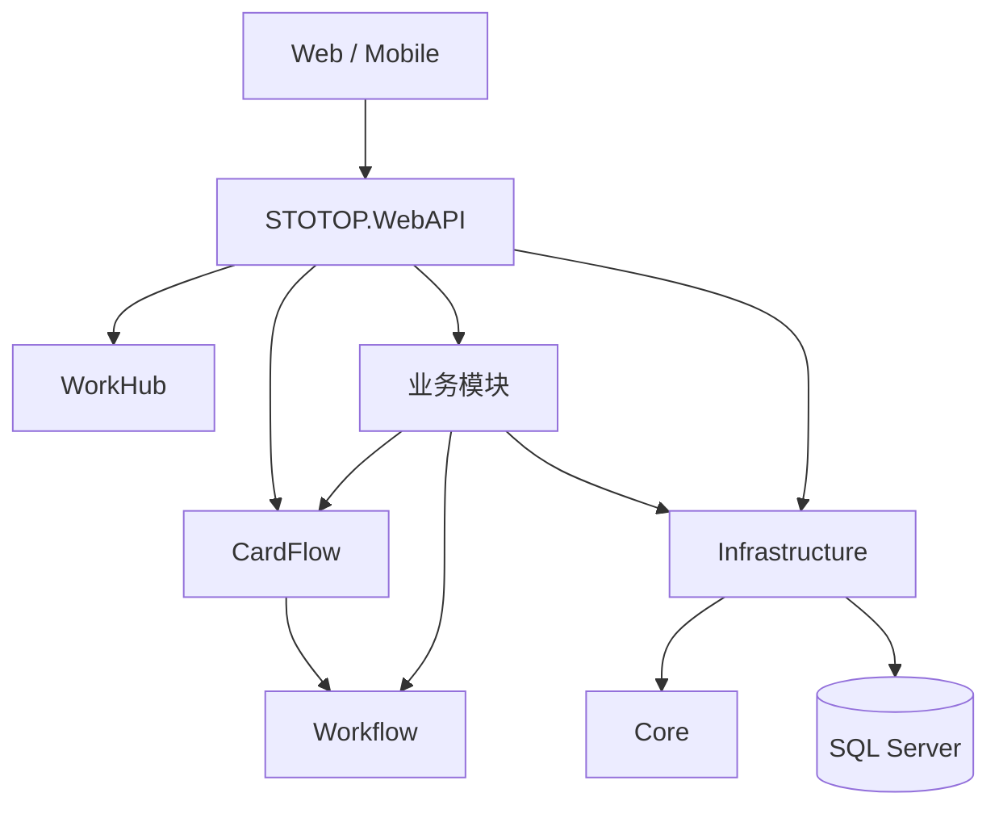

# STOTOP 系统总览

## 1. 项目定位

STOTOP 是一个模块化企业管理系统，覆盖快递计费、财务、CRM、任务目标、质量、合同、会议、宿舍、车辆、供应商、积分、薪酬等业务。当前运行时的核心协作入口是 WorkHub，审批与动态卡片流转统一由 CardFlow 承接。

历史 OA/BPM 文档已移除。代码中仍保留 `STOTOP.Module.OA` 与 `OASeeder`，但它们只用于旧数据兼容、引用迁移和退役清理；`Program.cs` 会移除 `STOTOP.Module.OA` 的 MVC ApplicationPart，不再暴露 OA 控制器作为新入口。

## 2. 技术栈

| 层级 | 技术 |
|------|------|
| 后端 | .NET 10、ASP.NET Core、EF Core、SQL Server |
| 后台任务 | Hangfire、SQL Server Storage |
| 实时通信 | SignalR |
| 前端 | Vue 3、Vite、TypeScript、Pinia |
| PC UI | Ant Design Vue |
| 移动端 UI | Vant |

## 3. 本地运行约定

| 项目 | 默认值 |
|------|--------|
| 后端地址 | `http://localhost:9000` |
| 前端地址 | `http://localhost:9001` |
| 前端代理 | `/api`、`/hangfire`、`/hubs` 到后端 |
| 后端健康检查 | `/health` |
| 版本信息 | `/api/version` |

## 4. 模块注册现状

`STOTOP.WebAPI` 是组合根，当前按 `Program.cs` 注册下列模块和服务。注：在所有业务模块之前，先注册多租户/平台地基服务 `IPlatformScopeFactory` / `ITenantResolver` / `ITenantScopeFactory` / `ITenantIterationService`（`Program.cs:313-317`）；平台超管/租户/套餐/订阅/IDP/开通能力内聚在 System 模块，无独立 Platform 模块（多租户隔离硬约束见 `design/21` §1.5）。WorkHub 为组合根内的聚合服务而非独立 `STOTOP.Module.*` 模块。

| 顺序 | 模块/服务 | 说明 |
|------|-----------|------|
| 1 | System | 用户、角色、组织、权限、菜单、**平台超管/租户/套餐/订阅/IDP/开通** |
| 2 | Finance | 财务、账套、凭证、报表、预算相关能力 |
| 3 | Supplier | 供应商与银行账户 |
| 4 | HR | 员工与人事基础资料 |
| 5 | Dormitory | 宿舍、房间、床位 |
| 6 | Vehicle | 车辆、租赁、维保 |
| 7 | Insurance | 保险、保单、理赔 |
| 8 | CardFlow | 卡片流转、动态表单、审批、导入校验、自动插件 |
| 9 | Express | 快递计费、报价、运单、账单 |
| 10 | Points | 积分、兑换、排名 |
| 11 | KSF | KSF 业务模块 |
| 12 | PPV | PPV 业务模块 |
| 13 | Salary | 薪酬业务模块 |
| 14 | Task | 目标、项目、任务、工作协作 |
| 15 | CRM | 客户、线索、跟进、报价联动 |
| 16 | Contract | 合同、模板、提醒 |
| 17 | Quality | 质量异常、知识库、派发处理 |
| 18 | Conference | 会议、活动、餐饮、场地 |
| 19 | Workflow | 事件、派发、质量处理等底层协作能力 |
| 20 | WorkHub | 跨模块待办、通知、工作入口聚合（组合根内聚合服务，非独立 `STOTOP.Module.*` 模块，无 `AddWorkHubModule`） |

CardFlow 必须早于 Express 注册，因为 Express 依赖导入服务与自动插件进度能力。

## 5. 架构边界

关键约束：

- 新审批、动态表单、节点流转、卡片待办默认进入 CardFlow。
- Task、CRM、Finance、Quality 等业务页只负责发起、追踪或展示业务上下文，不复制 CardFlow 运行时。
- Workflow 保留为派发、事件、质量处理等底层能力，不替代 CardFlow 审批运行时。
- 旧 DataCenter 设计不再作为独立模块推进，导入和校验能力集中在 CardFlow/Express 相关服务中。

## 6. 数据库命名约定

- 数据库名称使用小写。
- 所有数据库字段名以 `F` 开头，后面跟汉字或英文。
- 自增数字主键统一命名为 `FID`。
- 字符串编号主键统一命名为 `F编号`。

## 7. 文档索引

| 文档 | 说明 |
|------|------|
| [01-core.md](01-core.md) | Core 基础抽象、实体、接口 |
| [02-infrastructure.md](02-infrastructure.md) | Infrastructure、DbContext、Repository、迁移初始化 |
| [03-system.md](03-system.md) | System 用户、权限、组织、菜单 |
| [04-express.md](04-express.md) | Express 快递、运单、计费、报价 |
| [05-finance.md](05-finance.md) | Finance 凭证、科目、资产、报表 |
| [06-crm.md](06-crm.md) | CRM 客户、拜访、订单、商机 |
| [07-cardflow.md](07-cardflow.md) | CardFlow 卡片流转、动态表单、审批引擎、导入管道、自动插件 |
| [09-task.md](09-task.md) | Task 目标、项目、任务、绩效 |
| [10-quality.md](10-quality.md) | Quality 质量、异常、知识库 |
| [11-hr.md](11-hr.md) | HR 员工管理 |
| [12-contract.md](12-contract.md) | Contract 合同、模板、提醒 |
| [13-insurance.md](13-insurance.md) | Insurance 保险、保单、理赔 |
| [14-supplier.md](14-supplier.md) | Supplier 供应商、银行账户 |
| [15-points.md](15-points.md) | Points 积分、兑换、排名 |
| [16-conference.md](16-conference.md) | Conference 会议、活动、餐饮 |
| [17-dormitory.md](17-dormitory.md) | Dormitory 宿舍、楼栋、房间 |
| [18-vehicle.md](18-vehicle.md) | Vehicle 车辆、租赁、维保 |
| [19-webapi.md](19-webapi.md) | WebAPI 启动配置、中间件、模块注册 |
| [20-frontend.md](20-frontend.md) | 前端架构、路由、状态管理 |
| [21-dev-rules.md](21-dev-rules.md) | 开发规则：前后端约定、命名、多租户隔离、设计令牌门禁、测试与协作（**开发规范单一真源**；根 CLAUDE.md 是其面向 AI 的精简索引） |
| [22-claude-workflow.md](22-claude-workflow.md) | 用 Claude Code 高效开发：日常闭环、斜杠命令、子代理、大库提速、权限与门禁 |
| [23-multitenant-org-redesign.md](23-multitenant-org-redesign.md) | **（stage0-4 已实施；本文为原始目标态设计，as-built 偏差见各阶段提交与 CLAUDE.md/design/21 §1.5）** 多租户组织/租户/身份/数据权限重设计：区域公司=租户、四层隔离、两列两层 fail-closed 过滤器、R8 数据范围、外部 IdP、SaaS、迁移分阶段 |
| [24-tenant-migration-playbook.md](24-tenant-migration-playbook.md) | **（stage0-4 已实施）** 多租户隔离迁移实施手册：阶段0-4 依赖图、阶段0 加列+回填+三重校验全量代码/SQL、阶段1 fail-closed 过滤器落点、隔离自检纳门禁、关键文件锚点（配套 23） |
| [25-account-set-rule-p0.md](25-account-set-rule-p0.md) | **（已实施）** 账套规则（FinAccountSetRule）P0：制单审核分离/结转科目映射/凭证字白名单三项账套级会计控制，含 as-built 偏差与激活记录（V20、FID 2129/2130、baseline 模板明细漂移修复） |

新增设计文档默认使用中文，并优先记录当前运行边界而不是历史计划。标注"目标态设计"的文档记录原始设计意图，其 as-built 落地状态以标签与代码为准。
