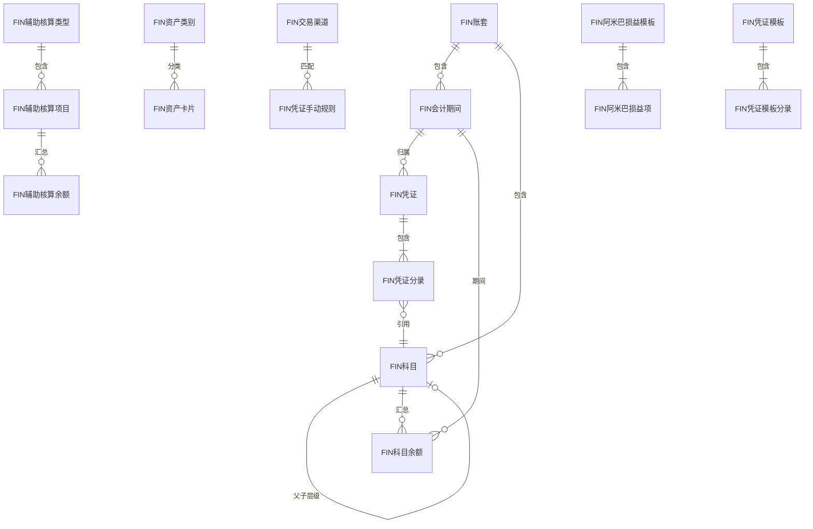
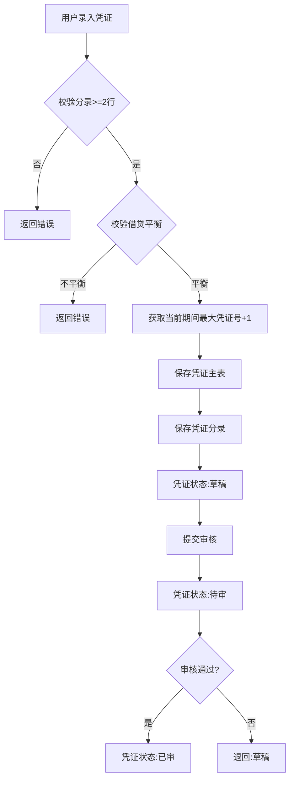
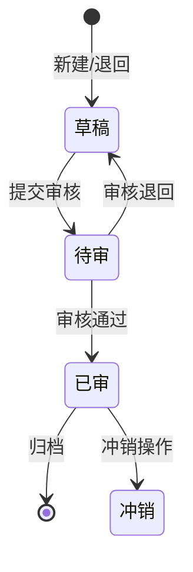
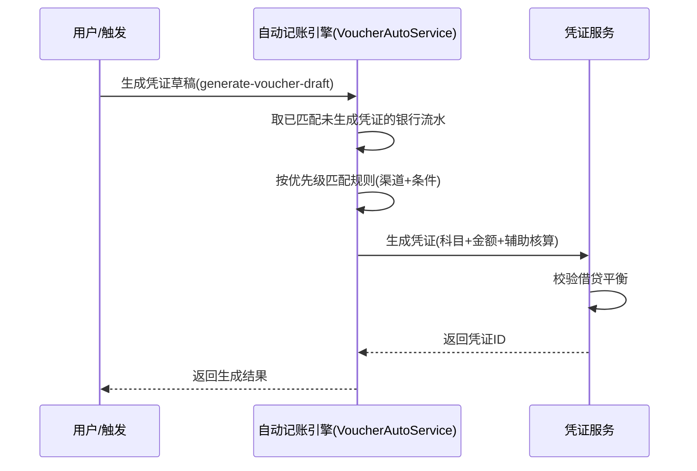
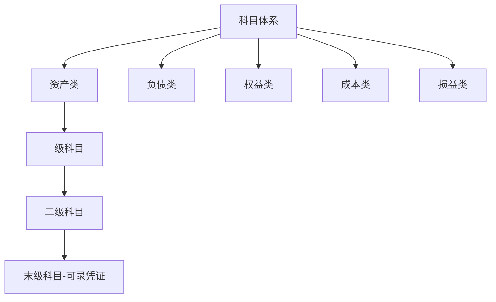

# Finance 模块设计文档

## 1. 模块职责与边界

### 核心职责
- 会计科目体系管理（三层科目、辅助核算）
- 凭证全生命周期（录入、审核、冲销、重排号）
- 多账套隔离与期间管理
- 财务报表生成（利润表、资产负债表、现金流量表、试算平衡）
- 自动记账规则引擎（基于银行流水按规则自动生成凭证）
- 固定资产管理与折旧
- 阿米巴损益核算
- 银行对账与发票管理

### 不负责的内容
- 原始业务数据的采集与导入（由 CardFlow / Express 的导入能力负责）
- 客户/供应商基础档案维护（由 CRM / 基础模块负责）
- 快递业务费用的计算逻辑（由 Express 模块负责）

### 依赖关系
| 方向 | 模块 | 说明 |
|------|------|------|
| 依赖 | 基础模块 | 组织、员工、部门等基础数据 |

## 2. 数据库表设计

### 核心实体表清单

> 主键统一为自增 `FID`（`long`，`BaseEntity`）；DB 列名为中文 `F+中文`，C# 实体属性为英文 `F+PascalCase`（如 `F规则名称`↔`FRuleName`），下表「关键字段」标注的是 DB 列名。注：少数表（如 FIN发票、FIN银行流水）的 DB 列名按代码实际为英文 `F+PascalCase`（`HasColumnName`），其余为中文 `F+中文`。

| 表名 | 中文说明 | 主键 | 关键字段 |
|------|----------|------|----------|
| FIN账套 | 账套管理 | FID | F名称, F编码, F法人名称, F是否默认, F起始年份 |
| FIN会计期间 | 期间管理 | FID | F年度, F期间号, F开始日期, F结束日期, F是否结账 |
| FIN科目 | 会计科目 | FID | F编码(unique), F名称, F类别, F余额方向, F级次, F父ID, F是否末级 |
| FIN辅助核算类型 | 核算维度 | FID | F名称(unique), F状态 |
| FIN辅助核算项目 | 核算明细 | FID | F编码, F名称, F来源类型, F来源ID |
| FIN凭证 | 会计凭证 | FID | F凭证字, F凭证号, F日期, F期间ID, F状态, F来源 |
| FIN凭证分录 | 凭证行 | FID | F凭证ID, F行号, F科目ID, F借方金额, F贷方金额, F辅助核算JSON |
| FIN科目余额 | 余额表 | FID | F期间ID, F科目ID, F期初余额, F本期余额, F期末余额 |
| FIN辅助核算余额 | 辅助余额 | FID | F期间ID, F科目ID, F辅助核算JSON, F期初借方, F期初贷方, F本期借方, F本期贷方, F期末借方, F期末贷方 |
| FIN凭证模板 | 模板管理 | FID | F名称, F描述 |
| FIN凭证模板分录 | 模板行 | FID | F模板ID, F行号, F科目ID, F方向 |
| FIN凭证手动规则 | 银行流水自动记账规则 | FID | F规则名称, F渠道ID, F匹配条件, F借方科目, F贷方科目, F优先级, F状态 |
| FIN资产类别 | 资产分类 | FID | F编码, F名称, F折旧方法, F使用年限, F残值率 |
| FIN资产卡片 | 资产台账 | FID | F编码, F类别ID, F原值, F累计折旧, F净值, F状态 |
| FIN阿米巴损益模板 | 损益模板 | FID | F名称, F描述 |
| FIN阿米巴损益项 | 模板项目 | FID | F模板ID, F项目名, F取数规则 |
| FIN汇率 | 外币汇率 | FID | F币种代码, F汇率, F生效日期 |
| FIN银行流水 | 银行流水 | FID | FTransactionDate, FDebitAmount, FCreditAmount, FDescription |
| FIN银行对账记录 | 对账记录 | FID | F交易ID, F对账单ID, F状态 |
| FIN发票 | 增值税发票 | FID | FInvoiceNo, FInvoiceType, FAmount, FTaxAmount |
| FIN交易渠道 | 支付/交易渠道 | FID | F名称, F类型, F状态 |
| FIN操作日志 | 审计日志 | FID | F操作类型, F操作人, F时间 |
| FIN变更历史 | 变更记录 | FID | F实体类型, F实体ID, F变更内容 |

### 表间关系

## 3. API 接口清单

### 凭证管理

| 方法 | 路径 | 功能 | 权限 |
|------|------|------|------|
| GET | /api/finance/vouchers | 凭证列表(分页) | accountset:voucher:view |
| GET | /api/finance/vouchers/{id} | 凭证详情 | accountset:voucher:view |
| POST | /api/finance/vouchers | 新增凭证 | accountset:voucher:create |
| PUT | /api/finance/vouchers/{id} | 修改凭证 | accountset:voucher:edit |
| DELETE | /api/finance/vouchers/{id} | 删除凭证 | accountset:voucher:delete |
| POST | /api/finance/vouchers/{id}/audit | 审核凭证 | accountset:voucher:audit |
| POST | /api/finance/vouchers/reverse/{id} | 冲销凭证 | accountset:voucher:create |
| POST | /api/finance/vouchers/reorder/{periodId} | 重排凭证号 | accountset:voucher:edit |

### 科目管理

| 方法 | 路径 | 功能 | 权限 |
|------|------|------|------|
| GET | /api/finance/accounts/tree | 科目树 | accountset:subject:view |
| GET | /api/finance/accounts | 平铺科目列表(选择器) | accountset:subject:view |
| POST | /api/finance/accounts | 新增科目 | accountset:subject:edit |
| PUT | /api/finance/accounts/{id} | 修改科目 | accountset:subject:edit |
| DELETE | /api/finance/accounts/{id} | 删除科目 | accountset:subject:edit |

### 期间管理

| 方法 | 路径 | 功能 | 权限 |
|------|------|------|------|
| GET | /api/finance/periods | 期间列表 | - |
| POST | /api/finance/periods/create/{year} | 初始化年度期间 | - |
| POST | /api/finance/periods/{id}/close | 期间结账 | finance:period:close |
| POST | /api/finance/periods/{id}/reopen | 反结账 | finance:period:reopen |

### 报表

| 方法 | 路径 | 功能 | 权限 |
|------|------|------|------|
| GET | /api/finance/reports/account-balance | 科目余额表 | - |
| GET | /api/finance/reports/auxiliary-balance | 辅助核算余额 | - |
| GET | /api/finance/reports/profit-statement | 利润表 | - |
| GET | /api/finance/reports/balance-sheet | 资产负债表 | - |
| GET | /api/finance/reports/cash-flow-report | 现金流量表 | - |
| GET | /api/finance/reports/amoeba-pl | 阿米巴损益 | - |

### 自动记账规则

| 方法 | 路径 | 功能 | 权限 |
|------|------|------|------|
| GET | /api/finance/banking-voucher-rules | 规则列表 | - |
| POST | /api/finance/banking-voucher-rules | 新增规则 | - |
| PUT | /api/finance/banking-voucher-rules/{id} | 修改规则 | - |
| DELETE | /api/finance/banking-voucher-rules/{id} | 删除规则 | - |

### 辅助核算

| 方法 | 路径 | 功能 | 权限 |
|------|------|------|------|
| GET | /api/finance/auxiliaries/types | 核算类型列表 | - |
| GET | /api/finance/auxiliary-items | 核算项目列表 | - |
| POST | /api/finance/auxiliary-items | 新增项目 | - |

### 账套管理

| 方法 | 路径 | 功能 | 权限 |
|------|------|------|------|
| GET | /api/finance/account-sets | 账套列表 | - |
| POST | /api/finance/account-sets | 新增账套 | - |
| PUT | /api/finance/account-sets/{id} | 修改账套 | - |
| DELETE | /api/finance/account-sets/{id} | 删除账套 | - |
| POST | /api/finance/account-sets/{id}/initialize | 初始化账套(预置科目/期间) | - |

### 资产管理

| 方法 | 路径 | 功能 | 权限 |
|------|------|------|------|
| GET | /api/finance/assets/cards | 资产卡片列表 | - |
| POST | /api/finance/assets/cards | 新增资产 | - |
| GET | /api/finance/assets/categories | 资产类别列表 | - |
| POST | /api/finance/assets/categories | 新增类别 | - |
| POST | /api/finance/assets/depreciation/{periodId} | 计提折旧 | - |

## 4. 业务流程

### 凭证生成流程

### 凭证状态转换

### 自动记账流程

### 科目体系结构

