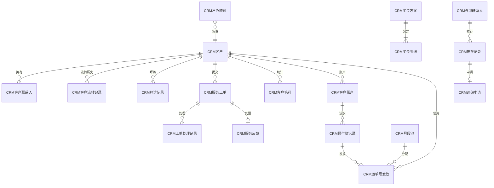
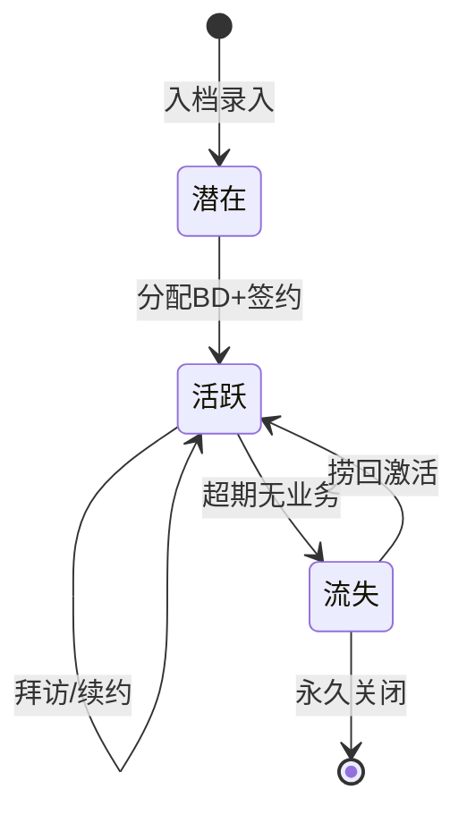
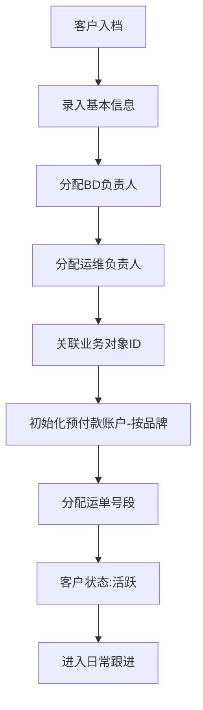
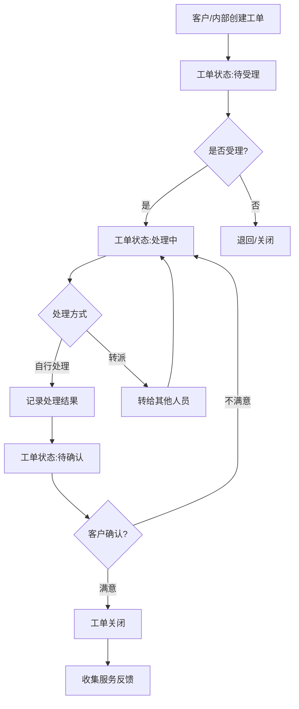
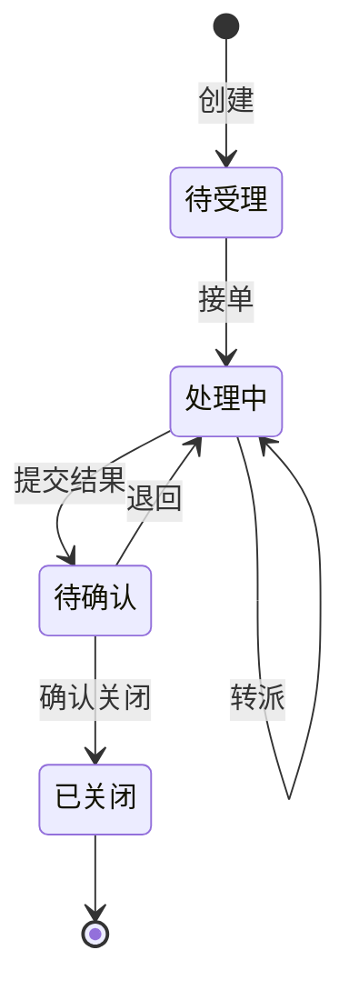
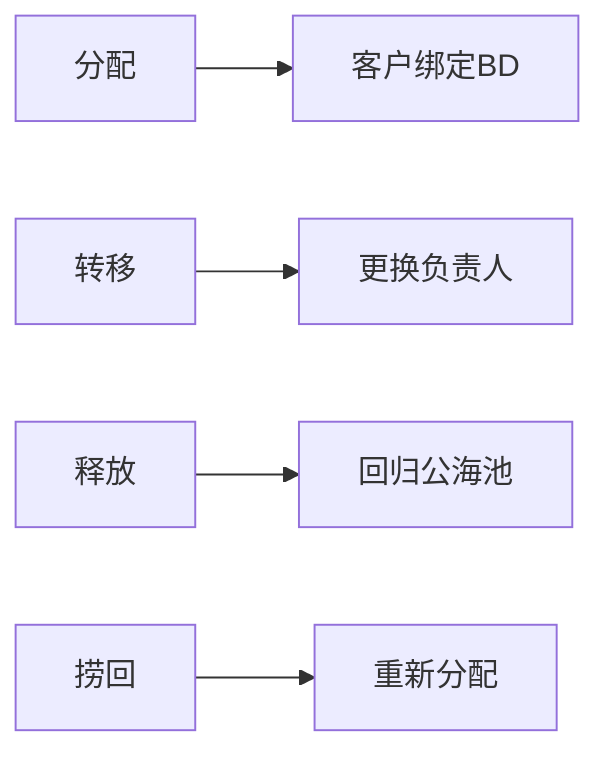

# CRM 模块设计文档

## 1. 模块职责与边界

### 核心职责
- 客户全生命周期管理（入档、分配、跟进、流失预警）
- BD/运维人员角色分配与客户绑定
- 服务工单全流程（创建→受理→处理→关闭→反馈）
- 客户毛利统计与奖金核算
- 预付款账户管理（按品牌隔离）
- 运单号段池分配
- 推荐佣金管理

### 不负责的内容
- 快递运单的实际业务处理（由 Express 模块负责）
- 财务凭证生成（由 Finance 模块负责）
- 数据文件导入解析（由 CardFlow / Express 模块负责）

### 依赖关系
| 方向 | 模块 | 说明 |
|------|------|------|
| 依赖 | 基础模块 | 员工、部门、组织等基础数据 |
| 依赖 | Express | 客户编号与业务对象ID关联，获取业务数据计算毛利 |
| 被依赖 | Express | 提供客户档案、预付款余额、运单号发放 |
| 被依赖 | Finance | 辅助核算项目来源(客户维度) |

## 2. 数据库表设计

### 核心实体表清单

| 表名 | 中文说明 | 主键 | 关键字段 |
|------|----------|------|----------|
| CRM客户 | 客户主档 | F编号(String) | F简称, F全称, F状态, FBD员工ID, F运维员工ID |
| CRM客户联系人 | 联系人信息 | FID(long) | F客户ID, F姓名, F电话, F职务, F角色标签 |
| CRM角色映射 | 员工角色 | FID(long) | F员工ID, F角色(1-BD/2-运维), F组织ID |
| CRM客户流转记录 | 流转历史 | FID(long) | F客户ID, F流转类型, F操作人ID, F创建时间 |
| CRM拜访记录 | 客户拜访 | FID(long) | F客户ID, F拜访人ID, F拜访方式, F内容, F拜访日期 |
| CRM服务工单 | 工单管理 | FID(long) | F工单号(unique), F客户ID, F分类, F状态, F优先级 |
| CRM工单处理记录 | 工单流转 | FID(long) | F工单ID, F操作类型, F操作人ID, F内容 |
| CRM客户毛利 | 毛利统计 | FID(long) | F客户ID, F期间(YYYYMM), F收入, F成本, F毛利, F毛利率 |
| CRM奖金方案 | 奖金规则 | FID(long) | F组织ID, F期间, F奖金总额, F计算规则, F状态 |
| CRM奖金明细 | 奖金发放 | FID(long) | F方案ID, F员工ID, F金额, F奖金类型 |
| CRM服务反馈 | 客户反馈 | FID(long) | F工单ID, F提交人ID, F分类, F标题, F状态 |
| CRM推荐记录 | 客户推荐 | FID(long) | F客户ID, F推荐人类型, F员工ID, F外部联系人ID, F推荐日期 |
| CRM返佣申请 | 佣金管理 | FID(long) | F推荐记录ID, F返佣金额, F状态 |
| CRM号段池 | 号段管理 | FID(long) | F起始号, F结束号, F品牌编码, F状态 |
| CRM运单号发放 | 号段使用 | FID(long) | F预付款ID, F号段池ID, F客户ID, F发放起始号, F发放结束号, F发放数量 |
| CRM客户账户 | 预付款账户 | FID(long) | F客户ID, F品牌编码, F余额, F累计充值, F累计消费, F冻结金额 |
| CRM预付款记录 | 预付款明细 | FID(long) | F客户账户ID, F客户ID, F品牌编码, F预付金额, F到账金额, F状态 |
| CRM外部联系人 | 推荐人 | FID(long) | F姓名, F电话, F公司, F收款账户, F开户行, F状态 |

### 表间关系

## 3. API 接口清单

### 客户管理

| 方法 | 路径 | 功能 | 权限 |
|------|------|------|------|
| GET | /api/crm/customers | 客户列表(分页+筛选) | crm:customer:view |
| GET | /api/crm/customers/statistics | 客户状态统计 | crm:customer:view |
| GET | /api/crm/customers/{code} | 客户详情 | crm:customer:view |
| POST | /api/crm/customers | 新增客户 | crm:customer:create |
| PUT | /api/crm/customers/{code} | 修改客户 | crm:customer:edit |
| DELETE | /api/crm/customers/{code} | 删除客户 | crm:customer:delete |
| PUT | /api/crm/customers/{code}/status | 变更客户状态 | crm:customer:edit |
| POST | /api/crm/customers/{code}/transfer | 客户转移(BD/运维) | crm:customer:edit |
| POST | /api/crm/customers/duplicate-check | 客户去重检测 | crm:customer:view |
| GET | /api/crm/customers/{code}/timeline | 客户时间线 | crm:customer:view |

### 联系人

无独立联系人端点。联系人内嵌在客户详情（`CustomerDto.Contacts`），随客户新增/修改请求中的 `Contacts` 数组一并维护（`POST/PUT /api/crm/customers`）。

### 服务工单

| 方法 | 路径 | 功能 | 权限 |
|------|------|------|------|
| GET | /api/crm/service-orders | 工单列表 | crm:order:view |
| GET | /api/crm/service-orders/{id} | 工单详情 | crm:order:view |
| POST | /api/crm/service-orders | 创建工单 | crm:order:create |
| PUT | /api/crm/service-orders/{id} | 修改工单 | crm:order:edit |
| DELETE | /api/crm/service-orders/{id} | 删除工单 | crm:order:edit |
| POST | /api/crm/service-orders/{id}/action | 工单流转(接单/处理/转派/关闭，按 operationType) | crm:order:edit |
| GET | /api/crm/service-orders/statistics | 工单统计 | crm:order:view |

### 服务反馈

| 方法 | 路径 | 功能 | 权限 |
|------|------|------|------|
| GET | /api/crm/feedback | 反馈列表 | crm:feedback:view |
| GET | /api/crm/feedback/{id} | 反馈详情 | crm:feedback:view |
| POST | /api/crm/feedback | 新增反馈 | crm:feedback:create |
| PUT | /api/crm/feedback/{id} | 修改反馈 | crm:feedback:create |
| DELETE | /api/crm/feedback/{id} | 删除反馈 | crm:feedback:create |
| POST | /api/crm/feedback/{id}/handle | 处理反馈 | crm:feedback:handle |

### 拜访记录

| 方法 | 路径 | 功能 | 权限 |
|------|------|------|------|
| GET | /api/crm/visits | 拜访记录列表 | crm:visit:view |
| GET | /api/crm/visits/{id} | 拜访记录详情 | crm:visit:view |
| POST | /api/crm/visits | 新增拜访 | crm:visit:create |
| PUT | /api/crm/visits/{id} | 修改拜访 | crm:visit:edit |
| DELETE | /api/crm/visits/{id} | 删除拜访 | crm:visit:edit |
| GET | /api/crm/visits/pending-follow-up | 待跟进列表 | crm:visit:view |
| GET | /api/crm/visits/statistics | 拜访统计 | crm:visit:view |

### 毛利分析

| 方法 | 路径 | 功能 | 权限 |
|------|------|------|------|
| GET | /api/crm/profits | 客户毛利列表 | crm:profit:view |
| GET | /api/crm/profits/{id} | 毛利详情 | crm:profit:view |
| POST | /api/crm/profits | 新增毛利记录 | crm:profit:calc |
| PUT | /api/crm/profits/{id} | 修改毛利记录 | crm:profit:calc |
| DELETE | /api/crm/profits/{id} | 删除毛利记录 | crm:profit:calc |
| GET | /api/crm/profits/summary | 毛利汇总 | crm:profit:view |
| GET | /api/crm/profits/ranking | 毛利排行 | crm:profit:view |

### 预付款管理

| 方法 | 路径 | 功能 | 权限 |
|------|------|------|------|
| GET | /api/crm/prepayments | 预付款列表 | crm:prepayment:view |
| GET | /api/crm/prepayments/{id} | 预付款详情 | crm:prepayment:view |
| POST | /api/crm/prepayments | 新增预付款 | crm:prepayment:create |
| PUT | /api/crm/prepayments/{id}/confirm | 确认到账 | crm:prepayment:allocate |
| GET | /api/crm/prepayments/account | 客户账户(按客户+品牌) | crm:prepayment:view |
| GET | /api/crm/prepayments/allocations/customer/{customerId} | 客户运单号发放记录 | crm:prepayment:view |

### 奖金/佣金

| 方法 | 路径 | 功能 | 权限 |
|------|------|------|------|
| GET | /api/crm/bonus/plans | 奖金方案列表 | crm:bonus:view |
| POST | /api/crm/bonus/plans | 新增方案 | crm:bonus:manage |
| GET | /api/crm/bonus/details | 奖金明细 | crm:bonus:view |
| POST | /api/crm/referrals | 创建推荐记录 | crm:referral:create |
| POST | /api/crm/commissions | 申请返佣 | crm:commission:apply |

## 4. 业务流程

### 客户生命周期

### 客户入档与分配流程

### 服务工单流程

### 工单状态转换

### 客户流转类型

