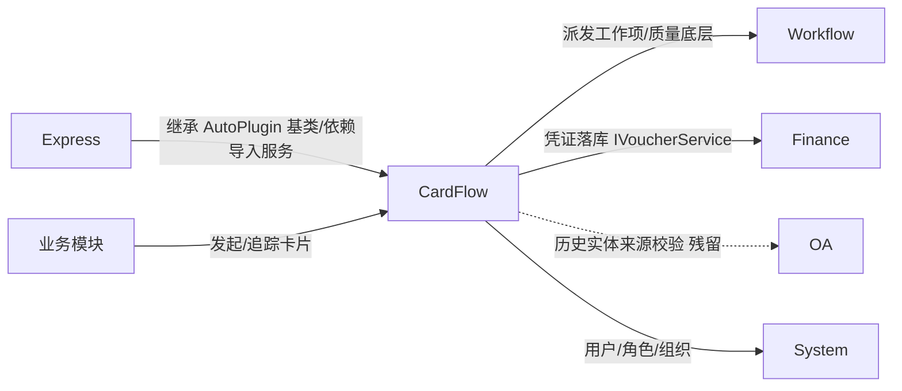
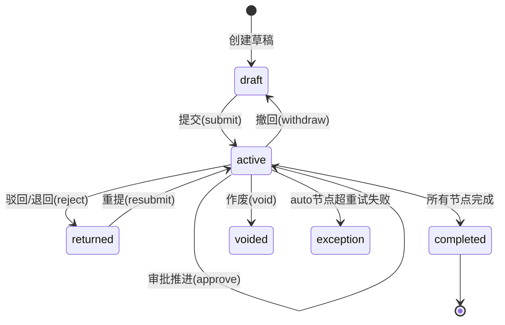
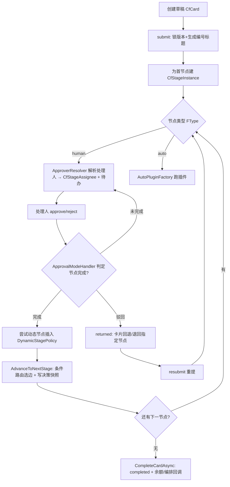
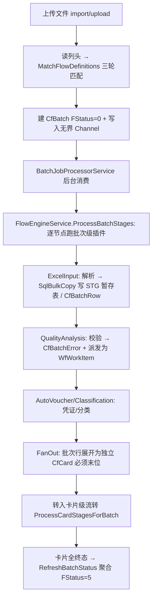

# CardFlow 卡片流转模块设计文档

> CardFlow 是全系统最大、最核心的运行时模块（393 个 C# 文件）。**所有新审批、动态表单、节点流转、卡片待办默认进入 CardFlow**（硬约束，见根 `CLAUDE.md`）。本文记录当前运行边界，不是历史计划。

## 1. 模块职责与边界

### 1.1 核心职责

CardFlow 是「审批 / 动态表单 / 节点流转 / 卡片待办」的统一运行时载体，同时承接从历史 DataCenter 迁入的批量导入管道。六大子系统：

- **流程引擎（FlowEngine）**：审批卡片的状态机——提交 / 审批 / 驳回 / 退回指定节点 / 撤回 / 重提 / 作废 / 加签 / 转办 / 抄送 / 催办，驱动节点推进、自动节点执行、动态节点插入、预算占用。
- **卡片与动态表单（Card）**：卡片即一次流程实例，承载主表单数据与明细行；表单 schema 配置化存储，运行时按节点视图渲染、脱敏、聚合。
- **条件路由与编排（Route / Orchestration）**：单流程内按条件选择下一节点（含路径预览、决策审计）；跨流程的 DAG 级编排引擎。
- **批量导入管道（Import / Batch / Staging）**：文件上传 → 列头匹配流程 → 批次 → 自动插件链处理 → FanOut 展开为卡片。
- **自动插件框架（AutoPlugin）**：可插拔的批次级数据处理步骤（解析 / 质检 / 分类 / 计价 / 凭证 / 展开），其他模块（如 Express）可扩展自有插件。
- **质量与凭证（Quality / Voucher）**：导入质检违规派发为工作项；自动凭证生成对接 Finance。

附属能力：派发（业务异常派人 / 跨流程派发）、通知（钉钉外部待办）、实时（SignalR）、下载任务（Playwright 无头浏览器）、文件管理。

### 1.2 不负责的内容（明确边界）

| 边界外内容 | 归属模块 |
|---|---|
| 工作项（WfWorkItem）、派发、质量处理等底层协作能力 | Workflow |
| 凭证最终落库与会计账务（FIN凭证） | Finance |
| 用户、角色、组织、菜单、权限 | System |
| 仓储基类、审计字段、组织隔离 | Core / Infrastructure |
| 快递计费 / 报价 / 账单业务逻辑 | Express |
| 跨模块待办聚合入口 | WorkHub |

CardFlow **不复制** Workflow 的工作项能力——它把质量问题/导入异常**派发为** `WfWorkItem` 并消费其状态；也**不写**最终凭证——它经 Finance 的 `IVoucherService` 落 `FIN凭证`。

### 1.3 与其他模块的依赖关系



- **CardFlow → Workflow**（单向）：质量派发、孤儿数据监控、批次撤销均引用 `WfWorkItem`/枚举/服务。Workflow **不反向依赖** CardFlow（已核实零引用），符合「Workflow 只做底层能力、不复制 CardFlow 运行时」。
- **Express → CardFlow**（反向依赖，决定注册顺序）：Express 的 `PricingPlugin` / `CostPlugin` **继承 CardFlow 的 `BatchPluginBase`** 并实现 `IQualityIssueTypeProvider`，构造注入 CardFlow 的 `IAutoPluginProgressReporter` / `IProgressNotifier` / `IProcessingIssueService` / `IBulkInsertService`，运行时由 CardFlow 的 `AutoPluginFactory` 创建执行。因此 **`AddCardFlowModule` 必须早于 `AddExpressModule`**（`Program.cs:336` < `:339`），否则 Express 插件依赖无法解析。反向解耦：计价解释接口 `IPricingExplainProvider` 定义在 CardFlow、由 Express 实现，避免 CardFlow→Express 反向依赖。
- **CardFlow → Finance**：自动/分类凭证经 `IVoucherService.CreateAsync` 落 `FIN凭证`（Finance 注册序 #2，早于 CardFlow #8）。
- **CardFlow → OA**（退役残留）：`.csproj` 仍有 ProjectReference，唯一代码引用是 `CardFlowSourceContextVerifier` 读 OA 历史实体做来源校验——属退役清理候选。

---

## 2. 运行时核心模型

### 2.1 三层定义结构（设计态）

```
CfFlowDefinition（流程定义，CF卡片流程）
  └── CfFlowVersion（版本，CF流程版本）        ← 表单 schema 存这里
        ├── CfStageDefinition[]（节点，CF流程节点）
        ├── CfStageRouteRule[]（条件出边，CF节点流转规则）
        └── CfDynamicStagePolicy[]（动态审批策略，CF动态审批策略）
```

- 一个定义有多个版本，但**同一时刻只有一个** `FIsCurrentVersion=true`。草稿编辑走「全删全建」（节点/路由/动态策略整体替换）。`PublishAsync` 发布前做路由图校验（Kahn 拓扑查环 + BFS 查不可达 + FanOut 必须是批次链末位）。
- **表单 schema 不在卡片上，而在版本上**：`CfFlowVersion.FCardSchemaJson`（主表单）+ `FDetailSchemaJson`（明细），均为 JSON。改版本 schema 会影响所有引用该版本的在途卡片渲染。

### 2.2 卡片运行时（执行态）

```
CfCard（卡片=流程实例，CF流程实例）
  ├── FFlowVersionId      ← 提交时锁定当前版本，整个生命周期不变
  ├── FCurrentStageInstanceId / FCurrentRound
  ├── FDataJson（主表单值） + CfCardDetail[]（明细行，CF实例明细）
  └── CfStageInstance[]（节点运行实例，CF节点执行实例，带 FRound 轮次）
        └── CfStageAssignee[]（指派处理人，CF节点处理人）
  ⟶ 每个动作追加 CfActionLog（CF操作日志）
  ⟶ 每次路由选边写 CfRouteDecisionSnapshot（CF流转决策快照）
```

提交时（`FlowEngineService.SubmitAsync`）锁定当前发布版本、校验 schema、生成编号（`NumberSequenceService`，`MERGE ... HOLDLOCK` 原子自增）与标题，为首节点建阶段实例。human 节点经 `ApproverResolver` 解析处理人并写指派人 + 待办；auto 节点直接跑插件。

### 2.3 卡片状态机



### 2.4 审批模式（`ApprovalModeHandler`）

| 模式 | 含义 | 完成条件 | 退回条件 |
|---|---|---|---|
| `single` | 独审 / 或签 | 任一通过 | 任一驳回 |
| `countersign` | 会签 | 全部通过 | 任一驳回 |
| `orsign` | 或签 | 任一通过 | **全部**驳回 |
| `sequential` | 顺签 | 全部通过 | 任一驳回 |

> 顺签初始仅第一个指派人 `pending`、其余 `waiting`，每人通过后按 `FSortOrder` 提升下一个（`SequentialApprovalRuntime`）。退回指定节点（`ReturnToStage`）依赖决策快照经 `RoutePathReconstructor` 重建本轮真实路径定位回退目标，并把目标下游已完成节点作废。

### 2.5 动态表单

| 关注点 | 实现 |
|---|---|
| schema 存储 | `CfFlowVersion.FCardSchemaJson` / `FDetailSchemaJson`，兼容 legacy（数组）与 V2（`{Version, Fields[], Components[]}`）两种格式 |
| 校验 + 标题 | `CardSchemaService.ValidateCardData` / `GenerateTitle`（best-effort，解析失败静默降级——配置错只会「字段消失」不报错） |
| 渲染态构建 | `CardPresentationResolver.Resolve` → 组件可见性 / 访问级（hidden/masked/editable/required/readonly）/ 字段脱敏 / 明细列权限 / 求和聚合 |
| 节点视图 | `StageViewProfileResolver` 合并节点 `FInputFieldsJson` 与版本 schema，产出当前处理人的工作视图 |
| 前端契约 | 运行时组件 DTO `CardComponentRuntimeDto`（Type/Access/Visible/Editable/Required/Masked/Value/Columns/Rows） |

---

## 3. 数据库表设计

表名取自 `Configurations/*.cs` 的 `ToTable`。列名 DB 用 `F+中文`、C# 属性用 `F+英文`（少数 `CfPluginRule` 例外，实体属性直接用中文）。

### 3.1 流程定义与版本

| 表名 | C# 实体 | 主键 | 关键字段 | 说明 |
|---|---|---|---|---|
| CF卡片流程 | `CfFlowDefinition` | FID | FFlowName, FFlowCode, FStatus, FNumberTemplate, FTitleTemplate, FMatchPattern, FTriggerConfigJson, FIsTemplate, FAccountSetId | 流程定义（IOrgScoped）。状态 draft/published/archived/disabled |
| CF流程版本 | `CfFlowVersion` | FID | FFlowDefinitionId, FVersionNumber, FStatus, **FCardSchemaJson**, **FDetailSchemaJson**, FFlowSettingsJson, FIsCurrentVersion | 版本快照，**表单 schema 真正存储处** |
| CF流程节点 | `CfStageDefinition` | FID | FStageKey, FSortOrder, FType(human/auto), F处理粒度(card/batch), FApprovalMode, FAssigneeStrategy, FAssigneeConfigJson, FConditionJson, FInputFieldsJson, F插件注册ID, F插件规则ID | 节点设计态 |
| CF节点流转规则 | `CfStageRouteRule` | FID | FFlowVersionId, FEdgeKey, FFrom/ToStageKey, FConditionJson, FPriority, FIsDefault | 单流程条件出边 |
| CF动态审批策略 | `CfDynamicStagePolicy` | FID | FSourceStageKey, FStrategyType, FConditionJson, FTriggerTiming, FInsertPosition, FMaxInsertCount | 运行时按条件自动插审批节点 |
| CF流程组 | `CfFlowGroup` | FID | FGroupName, FGroupCode, FStatus | 跨流程编排分组（IOrgScoped） |
| CF流程组连接 | `CfFlowGroupLink` | FID | FFlowGroupId, FSourceFlowId, FTargetFlowId, FTriggerCondition, FFieldMappingJson | 流程间连边 + 字段映射 |

### 3.2 卡片、表单与待办

| 表名 | C# 实体 | 主键 | 关键字段 | 说明 |
|---|---|---|---|---|
| CF流程实例 | `CfCard` | FID | FFlowDefinitionId, FFlowVersionId, FCardNumber, FTitle, FStatus, FDataJson, FCurrentStageInstanceId, FCurrentRound, FInitiatorId, FBatchId, FOrchestrationInstanceId | 卡片=流程实例（IOrgScoped，卡号唯一索引） |
| CF实例明细 | `CfCardDetail` | FID | FCardId, FDetailTableKey, FSortOrder, FDataJson | 动态表单明细行，按表键分组（全量替换持久化） |
| CF卡片余额 | `CfCardBalance` | FID | FCardId, FOriginalAmount, FOffsetAmount, FRemainingAmount, FStatus | 借支/预付—报销冲抵余额（IOrgScoped，乐观锁） |
| CF卡片关联 | `CfCardRelation` | FID | FSourceCardId, FTargetCardId, FRelationType(prerequisite/offset), FOffsetAmount, FSnapshotDataJson | 卡片间前置/冲抵关系 |
| CF待办项 | `CfTodoItem` | FID | FCardId, FStageInstanceId, FHandlerId, FType(todo/cc), FStatus, FPriority, FPushChannel, FExternalTodoId, FPushStatus | 待办/抄送（IOrgScoped，外部推送状态） |
| CF编号序号 | `CfNumberSequence` | FID | FFlowDefinitionId, FOrgId, FYear, FCurrentSequence | 单据编号流水（流程+组织+年唯一） |

### 3.3 节点运行实例与审计

| 表名 | C# 实体 | 主键 | 关键字段 | 说明 |
|---|---|---|---|---|
| CF节点执行实例 | `CfStageInstance` | FID | FCardId, FStageDefinitionId, FApprovalMode, FRound, FStatus, FFinalAction, FOpinion, FIsDynamicInsert | 节点运行态（乐观锁） |
| CF节点处理人 | `CfStageAssignee` | FID | FStageInstanceId, FUserId, FRoleCode, FSortOrder, FStatus, FOpinion | 会签/或签处理人 |
| CF操作日志 | `CfActionLog` | FID | FCardId, FStageInstanceId, FActionType, FOperatorId, FOperationTime, FOpinion | 审计流水（submit/approve/reject/returnToStage/withdraw/void/countersign/transfer/cc/urge…） |
| CF流转决策快照 | `CfRouteDecisionSnapshot` | FID | FCardId, FFrom/ToStageKey, FSelectedEdgeKey, FCandidateResultsJson, FRound | 路由选边审计 + 退回路径重建依据 |
| CF代审批委托 | `CfDelegation` | FID | FDelegatorId, FTrusteeId, FStartTime, FEndTime, FApplicableFlowsJson | 委托记录（IOrgScoped）。**当前未在引擎生效，见 §7** |

### 3.4 派发与编排

| 表名 | C# 实体 | 主键 | 关键字段 | 说明 |
|---|---|---|---|---|
| CF派发规则 | `CfDispatchRule` | FID | FTriggerEvent, FRuleType, FConditionJson, FHandlerType(AutoVoucher/WorkTask/AlertNotify/InfoRecord/Workflow), FHandlerConfigJson | 批次完成时分类触发处理器 |
| CF系统派发结果 | `CfSystemDispatchResult` | FID | FBatchId, FDispatchRuleId, FAffectedRowIds, FProcessingStatus | 派发规则命中结果 |
| CF业务派发记录 | `CfBusinessDispatchRecord` | FID | FBatchId, FErrorId, FAssignee, FDeadline, FStatus, FTargetType | 导入异常派给处理人（IOrgScoped） |
| CF派发记录 | `CfDispatchRecord` | FID | FOrchestrationInstanceId, FDispatchType(auto/manual), Source/Target NodeId+CardId+FlowCode, FDataPayloadJson | 跨流程派发统一历史 |
| CF自由派发配置 | `CfAdHocDispatchConfig` | FID | FSourceFlowCode, FTargetFlowCode, FDataProtocolJson, FIsEnabled | 「A 完成可手动触发 B」配置（IOrgScoped） |
| CF编排模板 | `CfOrchestrationTemplate` | FID | FCode, FNodesJson, FEdgesJson, FStatus, FMaxTriggerCount | 跨流程 DAG 模板（IOrgScoped） |
| CF编排实例 | `CfOrchestrationInstance` | FID | FTemplateId, FStatus, FSnapshotNodes/EdgesJson, FContextJson, FTriggerCount | 模板一次运行（IOrgScoped） |
| CF编排节点实例 | `CfOrchestrationNodeInstance` | FID | FOrchestrationInstanceId, FNodeId, FStatus, FRelatedCardId, FRelatedBatchId | DAG 节点运行态（幂等唯一约束） |

### 3.5 批量导入与暂存

| 表名 | C# 实体 | 主键 | 关键字段 | 说明 |
|---|---|---|---|---|
| CF批次 | `CfBatch` | FID | FFlowDefinitionId, FStatus(0-8), FActualTargetTable, FBatchNo, FFilePath, FFileHash, FOrchestrationInstanceId, FAccountSetId | 导入主表（IOrgScoped） |
| CF批次明细 | `CfBatchRow` | FID | FBatchId, FRowNo, FDataJson, FStatus(0-5), FCardId | 逐行暂存（batchRow 模式载体） |
| CF批次错误 | `CfBatchError` | FID | FBatchId, FErrorType, FSeverityLevel, FDispatchStatus, FResolutionStatus, FWorkItemId, FRetryStatus | 质检/计费异常 + 派发闭环（IOrgScoped；即 ProcessingIssue） |
| CF批次快照 | `CfBatchSnapshot` | FID | FBatchId, FAutoPluginName, FSnapshotType(Before/After), FStagingTable | 插件执行前后快照/轨迹 |
| STG\*（动态暂存表，50+ 张） | — | FID | F批次ID, F原始行号, F业务主键, FOrgId, F账套ID, FIsRevoked | ExcelInputPlugin 经 `SqlBulkCopy` 直写，表名由 `FActualTargetTable` 决定，必经 `StagingTableNameValidator` 校验 |

### 3.6 自动插件

| 表名 | C# 实体 | 主键 | 关键字段 | 说明 |
|---|---|---|---|---|
| CF自动插件注册 | `CfAutoPluginRegistry` | FID | F插件编码, F插件类型, F处理粒度, F默认配置JSON | 全局插件类型目录（节点 `F插件注册ID` 引用） |
| CF自动插件 | `CfPluginDef` | FID | F插件名称, F插件实现类型, F规则ID | 插件定义（IOrgScoped，迁自 CfAgentDefinition） |
| CF自动插件_规则 | `CfPluginRule` | FID | F类型编码, F规则配置JSON, F状态 | 运行期配置载体（IOrgScoped，属性用中文） |
| CF自动插件_执行记录 | `CfPluginExecution` | FID | FBatchId, FAutoPluginName, FStatus(10待运行/11进行中/12完成/13失败/14跳过) | 节点单次执行记录 |
| CF自动插件_规则命中统计 | `CfPluginRuleHitStat` | FID | FRuleId, FBatchId, FHitRowCount, FMissRowCount | 规则命中统计（IOrgScoped） |

### 3.7 质量、凭证、下载、文件、通知

| 表名 | C# 实体 | 主键 | 关键字段 | 说明 |
|---|---|---|---|---|
| CF质量规则 | `CfQualityRule` | FID | FRuleCode, FTargetTable, FRuleLevel(Field/Row/Batch), FCheckType, FErrorCode, FIsBlocking | 可配置质量校验规则 |
| CF质量问题类型 | `CfQualityIssueType` | FID | FCode, FResolveMode, FDispatchMode, FDispatchTarget, FCardFlowCode, FTimeoutHours, FIsBuiltIn | 派发注册表（启动时由 Registrar 同步） |
| CF凭证记录 | `CfVoucherRecord` | FID | FBatchId, FTotalRows, FMatchedRows, FUnmatchedRows, FVoucherIdsJson, FStatus | 凭证生成结果（非凭证本体） |
| CF下载任务 | `CfDownloadTask` | FID | FTaskName, FTargetUrl, FLoginPassword(加密), FStoragePath, FCronExpression, FHangfireJobId | Playwright 自动下载任务 |
| CF下载步骤 | `CfDownloadStep` | FID | FTaskId, FSortOrder, FActionType, FSelector, FValue | 浏览器操作步骤 |
| CF下载日志 | `CfDownloadLog` | FID | FTaskId, FStartTime, FStatus, FDownloadFileCount | 每次执行记录 |
| CF文件清理策略 | `CfFileCleanupPolicy` | FID | FPolicyName, FRetentionDays, FCronExpression, FHangfireJobId | 文件保留/清理 |
| CF通知配置 | `CfNotificationConfig` | FID | FConfigKey, FConfigValue | 钉钉等渠道 key-value 配置（IOrgScoped，org 级覆盖 org=0） |

---

## 4. API 接口清单

28 个控制器，统一 `ApiResult` 包装。绝大多数前缀 `api/cardflow/*`，例外：`OrchestrationController`（`api/orchestration/*`）、`CfQualityIssueTypeController` / `CfQualityDashboardController`（`api/quality-center/*`）。

> **权限码现状**：`CardFlowPermissions` 定义了完整的 `cardflow:*` 权限码，但**仅导入/暂存/派发/凭证/下载/文件类控制器实际挂 `[RequirePermission]`**；卡片、待办、流程定义、质量看板、AutoVoucher 等控制器目前**只挂 `[Authorize]`**，靠登录态 + 数据层 userId/orgId 过滤（部分权限码已定义未启用）。

### 4.1 控制器路由总表

| 控制器 | 路由前缀 | 职责 |
|---|---|---|
| `CardController` | `api/cardflow/cards` | 卡片 CRUD 与全部流转动作（submit/approve/reject/withdraw/resubmit/void/countersign/transfer/cc/urge） |
| `TodoController` | `api/cardflow/todos` | 我的待办 / 抄送 / 计数 / 统计 |
| `FlowDefinitionController` | `api/cardflow/definitions` | 流程定义 + 版本 + 草稿 + 路径预览 + 模板 |
| `FlowGroupController` | `api/cardflow/flow-groups` | 流程组与连接 |
| `DelegationController` | `api/cardflow/delegations` | 审批委托 CRUD |
| `OrchestrationController` | `api/orchestration/*` | 编排模板/实例（启动/暂停/恢复/取消） |
| `CfImportController` | `api/cardflow/import` | 文件上传/预览/分片、批次列表/处理/重试/撤销、异常派发 |
| `CfImportValidationController` | `api/cardflow/import-validation` | 导入计算验证工作台 |
| `CardFlowBatchController` | `api/cardflow/batches` | CfBatchRow 模式批次操作（上传/进度/确认/排除） |
| `CfBatchController` | `api/cardflow/batch` | 批次健康探针等（迁自 DataCenter） |
| `CfPipelineController` | `api/cardflow/pipeline` | 管道元数据、执行轨迹、暂存表元数据 |
| `CfAutoPluginController` | `api/cardflow/auto-plugin` | 插件注册目录 / 规则查询 |
| `CfAutoPluginRuleController` | `api/cardflow/auto-plugin-rules` | 插件规则 CRUD + 试跑 |
| `CfStagingController` | `api/cardflow/staging` | STG 暂存表数据 CRUD |
| `CfDispatchRuleController` | `api/cardflow/dispatch-rules` | 派发规则 + 分类引擎测试 |
| `CfProcessingIssueController` | `api/cardflow/issues` | 处理异常项（上报/派发/解决/忽略/重试） |
| `CfQualityRuleController` | `api/cardflow/quality-rules` | 质量规则 CRUD |
| `CfQualityIssueTypeController` | `api/quality-center/issue-types` | 质量问题类型 CRUD |
| `CfQualityDashboardController` | `api/quality-center/dashboard` | 质量看板（直查 WfWorkItem） |
| `CfAutoVoucherController` | `api/cardflow/auto-voucher` | AutoVoucher V2：字段分析 / DryRun / 规则 CRUD |
| `CfVoucherGenerationController` | `api/cardflow/voucher-generations` | 凭证生成记录查询 / 重试 |
| `CfExpenseClassificationController` | `api/cardflow/expense-classification` | 费用分类推荐 / 确认 / 生成凭证 |
| `CfDownloadTaskController` | `api/cardflow/download-tasks` | 自动下载任务管理 |
| `CfFileManagerController` | `api/cardflow/files` | 导入文件列表 / 统计 / 清理策略 |
| `CfAuditController` | `api/cardflow/audit` | 审计日志 / 运行监控 / 凭证溯源 |
| `NotificationSettingsController` | `api/cardflow/notification-settings` | 通知渠道配置 + 测试 |
| `NotificationCallbackController` | `api/cardflow/callback` | `[AllowAnonymous]` 外部渠道（钉钉）回调入口 |
| `CfHomeController` | `api/cardflow` | 首页统计（`cardflow:home` 权限码） |

### 4.2 核心端点示例（卡片与流转）

| 方法 | 路由 | 功能 |
|---|---|---|
| GET | `/cards/available-flows` | 可发起流程列表 |
| POST | `/cards` | 创建草稿 |
| GET | `/cards/{id}` | 卡片详情（含渲染视图 + 节点工作视图） |
| PUT | `/cards/{id}` | 更新草稿（含明细全量替换） |
| POST | `/cards/{id}/submit` | 提交（锁版本/生成编号标题/进入流转） |
| POST | `/cards/{id}/approve` \| `/reject` \| `/withdraw` \| `/resubmit` \| `/void` \| `/countersign` \| `/transfer` \| `/cc` \| `/urge` | 流转动作（委托 `IFlowEngineService`） |
| GET | `/cards/{id}/logs` | 操作日志 |
| GET | `/todos/mine` \| `/cc` \| `/count` \| `/stats` | 待办 / 抄送 / 角标 / 统计 |

---

## 5. 核心业务流程

### 5.1 审批流转生命周期



### 5.2 批量导入管道



> 批次状态机 `CfBatch.FStatus`：0 解析中 → 1 已暂存 → 2 质检中 → 3 已创建卡片 → 4 处理中 → 5 已完成；旁支 6 失败 / 7 部分完成 / 8 已撤销。崩溃恢复：启动扫描 `FStatus IN (0,2,4)` 且超 10 分钟的批次重新入队。

### 5.3 条件路由决策

- **两套求值器并存，勿混淆**：单流程路由用 `ConditionRuleEvaluator`（结构化 JSON，前缀寻址 `card./detailSummary./source./initiator./orgChain/roles.*`，算子 eq/neq/gt/contains/in/inOrgChain/between 等）；编排引擎内部用自己的简化 `EvaluateCondition`（`{field,op,value}`，算子有限），二者不共享代码。
- 运行时 `StageRouteResolver.ResolveNextStageAsync` 按 `FPriority` 逐条求值，命中即选，全不命中落 `FIsDefault` 默认分支；无路由规则则回退按 `FSortOrder` 线性下一节点。每次决策写 `CfRouteDecisionSnapshot`（候选评估明细 + 选中边 + 轮次）。
- 发布前 `RouteGraphValidator` 静态校验环 + 可达性；草稿可经 `CardFlowPathPreviewService` 干跑预览（不持久化）。

### 5.4 跨流程编排

`OrchestrationEngineService` 处理「流程的流程」（DAG，节点 start/cardflow/join/end）：模板 `StartAsync` 快照生成实例 → 子流程完成回调 `OnFlowCompletedAsync`/`OnBatchCompletedAsync`（`UPDLOCK,ROWLOCK` 行锁幂等）→ 评估出边 → 触发下游 cardflow 节点（创建卡片）/ join 汇聚 / end 完成。**注意**：`TriggerCardFlowNodeAsync` 当前是占位实现，只 new draft 卡片、未真正驱动 FlowEngine（见 §7）。

### 5.5 自动凭证生成

`AutoVoucherHandler`（V2 三层级联匹配：精确编码 → 分类 → 摘要关键词）由 `AutoVoucherPlugin` 在导入管道触发，按 GroupBy/规则组/业务日期拆分凭证、借贷平衡校验、业务键去重，经 Finance `IVoucherService.CreateAsync` 落 `FIN凭证`；结果记入 `CfVoucherRecord`。会计期间按业务日期 + 账套查 `FinAccountPeriod`（重试时无期间会自动建当月期间）。`UnmatchedAction` 支持 error/skip/createDraft。

---

## 6. 扩展点

| 要扩展 | 怎么做 |
|---|---|
| **新增自动插件** | 继承 `InputPluginBase` / `ProcessingPluginBase`（card 粒度）/ `BatchPluginBase`（batch 粒度），重写 `PluginName` + `ExecuteAsync`；在 `CardFlowModuleExtensions` 里 `AddScoped<T>()` + `AutoPluginFactory.Register<T>("Code")`。Express 的计费插件即跨模块范例。 |
| **新增审批人策略** | `ApproverResolver` 现支持 fixedUsers/role/fieldUsers/orgChain/amountMatrix/feeTypeBp/initiator；扩展在此集中处理，配置走节点 `FAssigneeConfigJson` |
| **新增条件算子** | 单流程路由扩 `ConditionRuleEvaluator.NormalizeOperator` + 求值分支；编排另有独立实现需同步 |
| **新增通知渠道** | 实现 `INotificationChannel`（参考 `DingTalkChannel`），注册到 DI，按 `CfTodoItem.FPushChannel` 选用 |
| **新增分类处理器** | 实现 `IClassificationHandler`，注册到 `ClassificationHandlerFactory`（现有 AutoVoucher/WorkTask/AlertNotify/InfoRecord） |

**已注册的 11 个内置插件**：ExcelInput / SecurityCheck / QualityAnalysis / Classification / AutoVoucher / WorkTask / AlertNotify / InfoRecord / VoucherMigration / FanOut / BatchSummary。

---

## 7. 已知技术债与坑（动手前必读）

> 这些是「文档不写、每次都要踩」的点，集中在此降低后续维护成本。

**运行时正确性**

- **后台执行必须手动设组织上下文**：`ProcessBatchStagesAsync` 等无 HttpContext 链路第一步须 `orgAccessor.CurrentOrgId = batch.FOrgId`，否则 EF 全局组织过滤器（`CurrentOrgId==null` 时整体放行）会**跨组织串数据**。
- **全局 NoTracking**：DbContext 默认 `NoTrackingWithIdentityResolution`，定义/批次更新必须显式 `.AsTracking()`，否则改动不落库。
- **AutoPluginFactory.Create 必须传 scoped provider**（插件全为 Scoped，单参重载已删除以防 captive 根容器）。
- **明细全量替换**：`CardService.UpdateAsync` 保存明细是「删旧插新」，客户端须每次提交完整明细集；并硬编码把明细 `amount` 之和回写 `FDataJson.amount`。
- **状态推进字符串匹配脆弱**：`GetPostPluginBatchStatus` 用 `pluginCode.Contains("QualityAnalysis"/"FanOut")` 判定，重命名插件编码会静默破坏状态机。
- **schema 静默降级**：非法 schema JSON 不报错，只会「字段消失」，排查配置问题时注意。

**未闭环 / 半成品**

- **委托（Delegation）未在引擎生效**：`CfDelegation` 全仓只有 CRUD，`FlowEngineService` / `ApproverResolver` 不查委托表，审批人解析与鉴权都不做受托人替换。
- **编排 ↔ FlowEngine 未打通**：`OrchestrationEngineService.TriggerCardFlowNodeAsync` 是占位实现，未真正启动子流程。
- **Events/ + EventHandlers/ 是死代码**：5 个事件 handler 类（`BatchLifecycleAuditHandler` + `ImportEventHandlers.cs` 内 4 个）**全部未在 `CardFlowModuleExtensions` 注册到 DI**（其他模块都在各自扩展里注册）→ 即便事件被发布也无人消费。发布点是存在的（`BatchRevokeHandler` 物理删除/撤销时发 `ImportBatchPurgedEvent`/`ImportBatchRevokedEvent`），其余 4 个事件（ImportBatchCompleted/Failed、ImportErrorDispatched、ClassificationCompleted）目前无发布点。属补注册或清理候选。
- **下载后自动导入未实现**：`DownloadEngineService` 下载完只 log，自动导入是 TODO。
- **审计溯源失效**：`AuditTrailService.TraceVoucherSourceAsync` 因旧映射表删除恒返回 null。
- **质量规则 test 接口是 mock**：`CfQualityRuleController POST /test` 返回空。

**历史包袱 / 易混淆**

- **三套插件元数据并存**：`CfAutoPluginRegistry`（目录）/ `CfPluginDef`（定义，迁自 CfAgentDefinition）/ `CfPluginRule`（运行配置）；节点优先用 `F插件注册ID`，旧 `FAutoPluginName` 已 `[Obsolete]` 仍兜底。
- **两类派发记录双轨**：`CfDispatchRecord`（跨流程派发）vs `CfBusinessDispatchRecord`（导入异常派人），语义不同刻意分表。
- **质量看板统计源是 WfWorkItem**（`FCategory="QualityIssue"`、`FModule="DataCenter"`），不是 `CfBatchError`，二者经 `FWorkItemId` 关联。
- **费用分类硬编码**：`CfExpenseClassificationController` 硬编码 `CfPluginRule` FID=15 + 表名 `STG费用支出记录` + 状态 `F凭证生成状态`，走 Dapper 裸 SQL。
- **DataCenter 残留标识**：`uploads/datacenter` 目录、`WfWorkItem.FModule="DataCenter"` 等历史命名仍在，DataCenter 模块本身已不推进。
- **OA ProjectReference 残留**：唯一引用是 `CardFlowSourceContextVerifier`，属退役清理候选。

---

## 8. 关键文件导航

| 关注 | 文件 |
|---|---|
| 流程引擎（2869 行，状态机心脏） | `Services/FlowEngineService.cs` |
| 定义/版本/发布 | `Services/FlowDefinitionService.cs` |
| 卡片 CRUD/详情装配 | `Services/CardService.cs` |
| 动态表单渲染 | `Services/CardPresentationResolver.cs`、`Models/Schema/` |
| 审批模式判定 | `Services/ApprovalModeHandler.cs`、`SequentialApprovalRuntime.cs`、`ReturnToStageRuntime.cs` |
| 审批人解析 | `Services/ApproverResolver.cs` |
| 条件路由 | `Services/ConditionRuleEvaluator.cs`、`StageRouteResolver`、`RouteGraphValidator.cs` |
| 编排引擎 | `Services/OrchestrationEngineService.cs` |
| 导入管道 | `Services/BatchTriggerService.cs`、`BatchJobProcessorService.cs`、`BatchLifecycleService.cs` |
| 自动插件框架 | `AutoPlugin/`（`IAutoPlugin.cs`、`AutoPluginFactory.cs`、`Implementations/`） |
| 自动凭证 | `Services/Handlers/AutoVoucherHandler.cs` |
| 模块装配 | `CardFlowModuleExtensions.cs`、组合根 `STOTOP.WebAPI/Program.cs`（注册顺序/Hangfire cron） |
