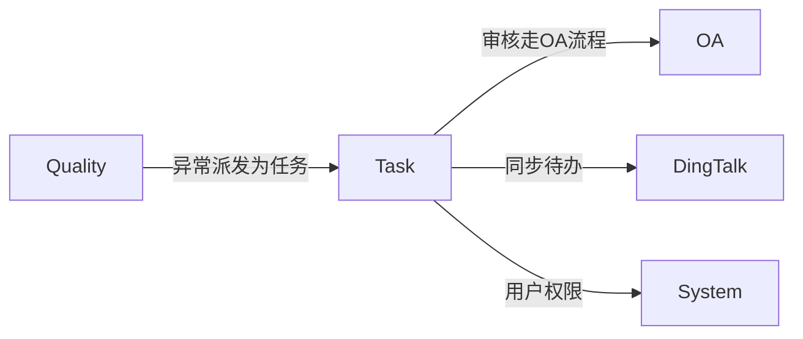
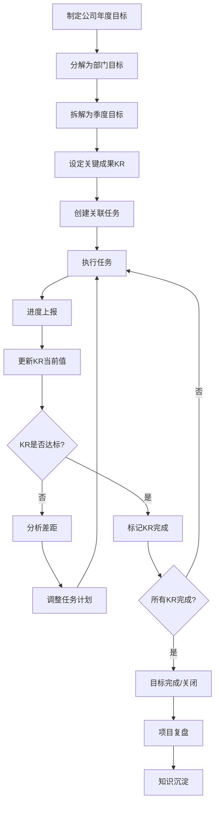
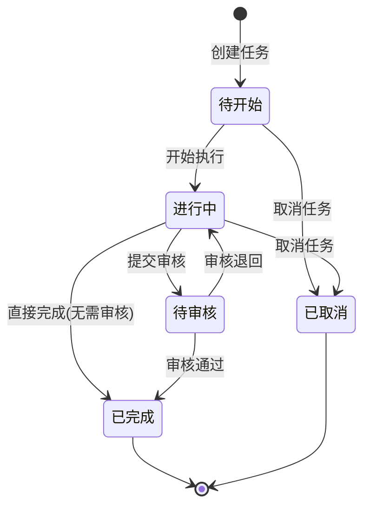
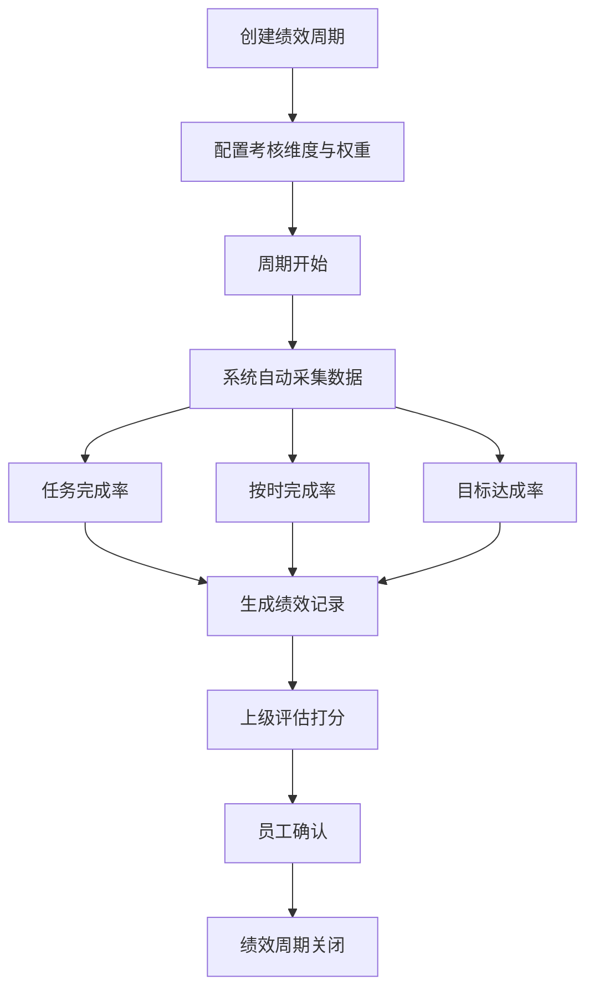

# Task 目标与任务管理模块设计文档

## 1. 模块职责与边界

### 1.1 核心职责

- **OKR目标管理**：公司/部门/个人多层级目标拆解，关键成果(KR)量化跟踪
- **项目任务管理**：项目→任务树形管理，支持看板视图，任务依赖与优先级
- **绩效评估**：基于目标完成率、任务及时率的多维度绩效考核
- **团队协作**：任务评论、进度上报、活动日志、实时通知
- **知识积累**：项目复盘与知识库沉淀

### 1.2 不负责的内容（明确边界）

| 边界外内容 | 归属模块 |
|---|---|
| 审批流程管理 | OA |
| 异常检测与质量监控 | Quality |
| 员工薪资与考勤 | Finance / OA |
| 用户权限、角色、菜单管理 | System |
| 部门组织架构管理 | System |

### 1.3 与其他模块的依赖关系



- **OA**：任务审核流程走OA审批
- **Quality**：异常派发为Task任务，关联跟踪
- **DingTalk**：任务待办同步至钉钉、消息推送
- **System**：用户权限与组织架构查询

### 1.4 目录结构

```
src/STOTOP.Module.Task/
├── Configurations/      # EF Core实体配置（28个）
├── Controllers/         # API控制器（15个）
├── Dtos/                # 数据传输对象（15个）
├── Entities/            # 领域实体（28个）
├── EventHandlers/       # 领域事件处理器
├── Events/              # 领域事件定义
├── Hubs/                # SignalR实时通知Hub
├── Jobs/                # 后台任务（6个：提醒/同步/统计等）
└── Services/            # 业务服务（15个接口 I*.cs 平铺在根，无 Interfaces 子目录）
    └── DingTalk/        # 钉钉集成服务（唯一子目录）
```

---

## 2. 数据库表设计

### 2.1 OKR体系（2张表）

#### TmGoal — 目标表

| 字段名 | 类型 | 说明 |
|---|---|---|
| FID | BIGINT PK | 主键 |
| FUID | NVARCHAR(32) | 业务唯一标识 |
| FTitle | NVARCHAR(200) | 目标标题 |
| FDescription | NVARCHAR(MAX) | 目标描述 |
| FLevel | NVARCHAR(20) | 级别：yearly/quarterly/monthly |
| FParentId | BIGINT | 父目标ID（自引用，支持多层级拆解，默认0） |
| FResponsibleId | BIGINT | 目标责任人ID |
| FGoalOrgId | BIGINT | 目标所属组织ID |
| FStartDate | DATE | 开始日期 |
| FEndDate | DATE | 结束日期 |
| FStatus | INT | 状态：0=草稿, 1=进行中, 2=已完成, 3=已关闭 |
| FProgress | INT | 整体进度（0-100） |
| FWeight | INT | 权重（默认100） |
| FOrgId | BIGINT | 组织ID |
| FCreatorId | BIGINT | 创建人ID |
| FCreateTime | DATETIME2 | 创建时间 |
| FUpdateTime | DATETIME2 | 更新时间 |

#### TmKeyResult — 关键成果表

| 字段名 | 类型 | 说明 |
|---|---|---|
| FID | BIGINT PK | 主键 |
| FUID | NVARCHAR(32) | 业务唯一标识 |
| FOrgId | BIGINT | 组织ID |
| FGoalId | BIGINT FK | 关联目标 |
| FTitle | NVARCHAR(200) | KR标题 |
| FMeasureType | INT | 度量类型：1=定性, 2=定量 |
| FTargetValue | DECIMAL(18,2) | 目标值 |
| FCurrentValue | DECIMAL(18,2) | 当前值 |
| FStartValue | DECIMAL(18,2) | 起始值（默认0） |
| FUnit | NVARCHAR(20) | 单位（%/个/万元等） |
| FWeight | INT | 权重（默认100） |
| FProgress | INT | 进度（自动计算） |
| FResponsibleId | BIGINT | 责任人ID |
| FStatus | INT | 状态：0=未开始, 1=进行中, 2=已完成 |
| FSort | INT | 排序号 |
| FCreateTime | DATETIME2 | 创建时间 |
| FUpdateTime | DATETIME2 | 更新时间 |

> **KR进度计算公式**：`FProgress = (FCurrentValue - FStartValue) / (FTargetValue - FStartValue) * 100`

### 2.2 项目与任务核心（7张表）

#### TmProject — 项目表

| 字段名 | 类型 | 说明 |
|---|---|---|
| FID | BIGINT PK | 主键 |
| FUID | NVARCHAR(32) | 业务唯一标识 |
| FName | NVARCHAR(200) | 项目名称 |
| FDescription | NVARCHAR(MAX) | 项目描述 |
| FStatus | INT | 状态：0=规划中, 1=进行中, 2=已完成, 3=已归档 |
| FStartDate | DATETIME2 | 开始日期（可空） |
| FEndDate | DATETIME2 | 截止日期（可空） |
| FManagerId | BIGINT | 项目负责人ID |
| FGoalId | BIGINT FK | 关联目标（可空） |
| FOrgId | BIGINT | 组织ID |
| FCreatorId | BIGINT | 创建人ID |
| FCreateTime | DATETIME2 | 创建时间 |
| FUpdateTime | DATETIME2 | 更新时间 |

#### TmProjectMember — 项目成员表

| 字段名 | 类型 | 说明 |
|---|---|---|
| FID | BIGINT PK | 主键 |
| FOrgId | BIGINT | 组织ID |
| FProjectId | BIGINT FK | 关联项目 |
| FUserId | BIGINT | 成员用户ID |
| FRole | INT | 角色（数字编码） |
| FJoinTime | DATETIME2 | 加入时间 |

#### TmTask — 任务表

| 字段名 | 类型 | 说明 |
|---|---|---|
| FID | BIGINT PK | 主键 |
| FUID | NVARCHAR(32) | 业务唯一标识 |
| FTitle | NVARCHAR(500) | 任务标题 |
| FDescription | NVARCHAR(MAX) | 任务描述（富文本） |
| FProjectId | BIGINT FK | 关联项目（可空） |
| FGoalId | BIGINT FK | 关联目标（可空） |
| FKRId | BIGINT FK | 关联KR（可空，列名 FKRID） |
| FParentTaskId | BIGINT | 父任务ID（树形父子结构，默认0） |
| FType | INT | 任务类型（默认0） |
| FPriority | INT | 优先级：1=低, 2=中, 3=高, 4=紧急 |
| FStatus | INT | 状态：0=待开始, 1=进行中, 2=已完成, 3=已取消, 4=待审核 |
| FAssigneeId | BIGINT | 执行人ID（可空） |
| FProgress | INT | 进度（0-100） |
| FPlanStart | DATETIME2 | 计划开始（可空） |
| FPlanEnd | DATETIME2 | 计划截止（可空） |
| FActualStart | DATETIME2 | 实际开始（可空） |
| FActualEnd | DATETIME2 | 实际完成（可空） |
| FEstimatedHours | DECIMAL(10,1) | 预估工时（可空） |
| FActualHours | DECIMAL(10,1) | 实际工时（可空） |
| FVisibility | INT | 可见范围（默认0） |
| FIsTemplate | BIT | 是否模板（默认false） |
| FCode | NVARCHAR(20) | 任务编号（可空） |
| FSort | INT | 排序号 |
| FCreatorId | BIGINT | 创建人ID |
| FOrgId | BIGINT | 组织ID |
| FCreateTime | DATETIME2 | 创建时间 |
| FUpdateTime | DATETIME2 | 更新时间 |

#### TmTaskMember — 任务成员表

| 字段名 | 类型 | 说明 |
|---|---|---|
| FID | BIGINT PK | 主键 |
| FOrgId | BIGINT | 组织ID |
| FTaskId | BIGINT FK | 关联任务 |
| FUserId | BIGINT | 成员用户ID |
| FRole | INT | 角色：0=创建者, 1=执行人, 2=协作者, 3=审核人 |

#### TmTaskDependency — 任务依赖表

| 字段名 | 类型 | 说明 |
|---|---|---|
| FID | BIGINT PK | 主键 |
| FOrgId | BIGINT | 组织ID |
| FTaskId | BIGINT FK | 当前任务 |
| FDependsOnTaskId | BIGINT FK | 依赖的任务 |
| FDependencyType | INT | 类型：0=前置(FS), 1=后置(SF), 2=阻塞(SS) |

#### TmTaskTag — 任务标签关联表

| 字段名 | 类型 | 说明 |
|---|---|---|
| FID | BIGINT PK | 主键 |
| FTaskId | BIGINT FK | 关联任务 |
| FTagId | BIGINT FK | 关联标签 |

#### TmTag — 标签表

| 字段名 | 类型 | 说明 |
|---|---|---|
| FID | BIGINT PK | 主键 |
| FName | NVARCHAR(50) | 标签名称 |
| FColor | NVARCHAR(20) | 标签颜色 |
| FOrgId | BIGINT | 组织ID |
| FSort | INT | 排序号 |

### 2.3 协作评论（5张表）

#### TmTaskComment — 任务评论表

| 字段名 | 类型 | 说明 |
|---|---|---|
| FID | BIGINT PK | 主键 |
| FOrgId | BIGINT | 组织ID |
| FTaskId | BIGINT FK | 关联任务 |
| FUserId | BIGINT | 评论人ID |
| FContent | NVARCHAR(MAX) | 评论内容 |
| FType | INT | 评论类型（默认0） |
| FParentCommentId | BIGINT | 父评论ID（嵌套评论，默认0） |
| FPushedToDingTalk | BIT | 是否已推送钉钉（默认false） |
| FCreateTime | DATETIME2 | 评论时间 |
| FUpdateTime | DATETIME2 | 更新时间 |

#### TmCommentReaction — 评论反应表

| 字段名 | 类型 | 说明 |
|---|---|---|
| FID | BIGINT PK | 主键 |
| FOrgId | BIGINT | 组织ID |
| FCommentId | BIGINT FK | 关联评论 |
| FUserId | BIGINT | 用户ID |
| FEmojiCode | NVARCHAR | 表情代码 |
| FCreateTime | DATETIME2 | 创建时间 |

#### TmAttachment — 任务附件表

| 字段名 | 类型 | 说明 |
|---|---|---|
| FID | BIGINT PK | 主键 |
| FOrgId | BIGINT | 组织ID |
| FRelationType | INT | 关联对象类型（任务/项目/复盘等） |
| FRelationId | BIGINT | 关联对象ID |
| FUserId | BIGINT | 上传人ID |
| FOriginalFileName | NVARCHAR(200) | 原始文件名 |
| FStoragePath | NVARCHAR(500) | 存储路径 |
| FFileSize | BIGINT | 文件大小（字节） |
| FFileType | NVARCHAR(50) | 文件类型 |
| FCreateTime | DATETIME2 | 上传时间 |

#### TmProgressReport — 进度上报表

| 字段名 | 类型 | 说明 |
|---|---|---|
| FID | BIGINT PK | 主键 |
| FOrgId | BIGINT | 组织ID |
| FTaskId | BIGINT FK | 关联任务 |
| FReporterId | BIGINT | 上报人ID |
| FProgress | INT | 上报进度 |
| FContent | NVARCHAR | 上报内容 |
| FHours | DECIMAL(10,1) | 本次耗时（可空） |
| FPushedToDingTalk | BIT | 是否已推送钉钉（默认false） |
| FCreateTime | DATETIME2 | 创建时间 |

#### TmActivityLog — 活动日志表

| 字段名 | 类型 | 说明 |
|---|---|---|
| FID | BIGINT PK | 主键 |
| FOrgId | BIGINT | 组织ID |
| FTaskId | BIGINT FK | 关联任务 |
| FActionType | INT | 动作类型（数字编码） |
| FOldValue | NVARCHAR(200) | 变更前值（可空） |
| FNewValue | NVARCHAR(200) | 变更后值（可空） |
| FOperatorId | BIGINT | 操作人ID |
| FRemark | NVARCHAR(500) | 备注 |
| FCreateTime | DATETIME2 | 操作时间 |

### 2.4 计划提醒（3张表）

#### TmTaskReminder — 任务提醒表

| 字段名 | 类型 | 说明 |
|---|---|---|
| FID | BIGINT PK | 主键 |
| FOrgId | BIGINT | 组织ID |
| FTaskId | BIGINT FK | 关联任务 |
| FUserId | BIGINT | 提醒对象ID |
| FReminderTime | DATETIME2 | 提醒时间 |
| FReminderType | INT | 提醒类型：0=一次性, 1=每日, 2=自定义 |
| FIsRead | BIT | 是否已读（默认false） |
| FIsSent | BIT | 是否已发送（默认false） |
| FCreateTime | DATETIME2 | 创建时间 |

#### TmTaskSchedule — 任务定时计划表

| 字段名 | 类型 | 说明 |
|---|---|---|
| FID | BIGINT PK | 主键 |
| FTemplateTaskId | BIGINT FK | 模板任务ID |
| FScheduleType | INT | 计划类型 |
| FCronExpression | NVARCHAR(100) | Cron表达式（可空） |
| FScheduledTime | DATETIME2 | 计划执行时间（可空） |
| FNextExecution | DATETIME2 | 下次执行时间（可空） |
| FLastExecution | DATETIME2 | 上次执行时间（可空） |
| FIsEnabled | BIT | 是否启用（默认true） |
| FCreateTime | DATETIME2 | 创建时间 |

#### TmNotification — 通知表

| 字段名 | 类型 | 说明 |
|---|---|---|
| FID | BIGINT PK | 主键 |
| FOrgId | BIGINT | 组织ID |
| FReceiverId | BIGINT | 接收人ID |
| FEventType | INT | 事件类型：0=任务分配, 1=截止提醒, 2=评论@, 3=状态变更 |
| FTitle | NVARCHAR(200) | 通知标题 |
| FContent | NVARCHAR(500) | 通知内容 |
| FRelationType | INT | 关联对象类型（任务/目标/项目等） |
| FRelationId | BIGINT | 关联对象ID |
| FIsRead | BIT | 是否已读（默认false） |
| FPushedToDingTalk | BIT | 是否已推送钉钉（默认false） |
| FCreateTime | DATETIME2 | 创建时间 |

### 2.5 绩效评估（4张表）

#### TmPerformancePeriod — 绩效周期表

| 字段名 | 类型 | 说明 |
|---|---|---|
| FID | BIGINT PK | 主键 |
| FUID | NVARCHAR(32) | 业务唯一标识 |
| FName | NVARCHAR(100) | 周期名称 |
| FOrgId | BIGINT | 组织ID |
| FType | INT | 类型：月度/季度/年度（数字编码） |
| FStartDate | DATETIME2 | 开始日期 |
| FEndDate | DATETIME2 | 结束日期 |
| FStatus | INT | 状态：0=未开始, 1=评估中, 2=已完成 |
| FCreatorId | BIGINT | 创建人ID |
| FCreateTime | DATETIME2 | 创建时间 |
| FUpdateTime | DATETIME2 | 更新时间 |

#### TmPerformanceRecord — 绩效记录表

| 字段名 | 类型 | 说明 |
|---|---|---|
| FID | BIGINT PK | 主键 |
| FPeriodId | BIGINT FK | 关联考核周期 |
| FEmployeeId | BIGINT | 被考核人ID |
| FOrgId | BIGINT | 组织ID |
| FTaskTotal | INT | 任务总数 |
| FCompletedCount | INT | 完成数 |
| FOnTimeCount | INT | 按时完成数 |
| FOverdueCount | INT | 逾期数 |
| FCompletionRate | DECIMAL(5,2) | 任务完成率 |
| FOnTimeRate | DECIMAL(5,2) | 按时完成率 |
| FGoalAchievementRate | DECIMAL(5,2) | 目标达成率 |
| FQualityScore | DECIMAL(3,1) | 质量评分（可空） |
| FSelfScore | DECIMAL(3,1) | 自评评分（可空） |
| FOverallScore | DECIMAL(5,2) | 综合得分（可空） |
| FGrade | NVARCHAR(10) | 考核等级（可空） |
| FComment | NVARCHAR | 评语（可空） |
| FSelfComment | NVARCHAR | 自评（可空） |
| FStatus | INT | 状态：0=待评估, 1=已评估, 2=已确认 |
| FCreateTime | DATETIME2 | 创建时间 |
| FUpdateTime | DATETIME2 | 更新时间 |

#### TmPerformanceDimension — 绩效维度表

| 字段名 | 类型 | 说明 |
|---|---|---|
| FID | BIGINT PK | 主键 |
| FOrgId | BIGINT | 组织ID |
| FDimensionName | NVARCHAR(50) | 维度名称（如：目标完成、任务及时率、协作评价） |
| FDimensionCode | NVARCHAR(50) | 维度编码 |
| FDataSource | INT | 数据来源（数字编码：自动任务/自动目标/手动等） |
| FWeight | INT | 权重（默认100） |
| FMaxScore | DECIMAL(5,2) | 满分（默认100） |
| FSort | INT | 排序号 |
| FIsEnabled | BIT | 是否启用（默认true） |

#### TmPerformanceScore — 绩效维度得分表

| 字段名 | 类型 | 说明 |
|---|---|---|
| FID | BIGINT PK | 主键 |
| FOrgId | BIGINT | 组织ID |
| FRecordId | BIGINT FK | 关联考核记录 |
| FDimensionId | BIGINT FK | 关联绩效维度 |
| FScore | DECIMAL(5,2) | 得分（可空） |
| FEvaluator | NVARCHAR(10) | 评价人（可空） |
| FRemark | NVARCHAR(500) | 评分说明（可空） |

### 2.6 复盘知识（4张表）

#### TmReviewRecord — 复盘记录表

| 字段名 | 类型 | 说明 |
|---|---|---|
| FID | BIGINT PK | 主键 |
| FUID | NVARCHAR(32) | 业务唯一标识 |
| FRelationType | INT | 关联对象类型（项目/目标等） |
| FRelationId | BIGINT | 关联对象ID |
| FOrgId | BIGINT | 组织ID |
| FTitle | NVARCHAR(200) | 复盘标题 |
| FWentWell | NVARCHAR(MAX) | 做得好的（可空） |
| FToImprove | NVARCHAR(MAX) | 待改进的（可空） |
| FLessonsLearned | NVARCHAR(MAX) | 经验方法（可空） |
| FActionPlan | NVARCHAR(MAX) | 行动计划（可空） |
| FReviewerId | BIGINT | 复盘人ID |
| FParticipantIds | NVARCHAR(500) | 参与人ID列表（可空） |
| FStatus | INT | 状态（默认0） |
| FCreateTime | DATETIME2 | 创建时间 |
| FUpdateTime | DATETIME2 | 更新时间 |

#### TmKnowledge — 知识库表

| 字段名 | 类型 | 说明 |
|---|---|---|
| FID | BIGINT PK | 主键 |
| FUID | NVARCHAR(32) | 业务唯一标识 |
| FTitle | NVARCHAR(200) | 知识标题 |
| FContent | NVARCHAR(MAX) | 知识内容（富文本，可空） |
| FCategory | INT | 分类（数字编码） |
| FOrgId | BIGINT | 组织ID |
| FAuthorId | BIGINT | 作者ID |
| FSourceReviewId | BIGINT FK | 来源复盘记录ID（可空） |
| FSourceTaskId | BIGINT FK | 来源任务ID（可空） |
| FSourceProjectId | BIGINT FK | 来源项目ID（可空） |
| FViewCount | INT | 浏览次数 |
| FLikeCount | INT | 点赞数 |
| FCollectCount | INT | 收藏数 |
| FStatus | INT | 状态（默认0） |
| FIsPinned | BIT | 是否置顶（默认false） |
| FCreateTime | DATETIME2 | 创建时间 |
| FUpdateTime | DATETIME2 | 更新时间 |

#### TmKnowledgeComment — 知识评论表

| 字段名 | 类型 | 说明 |
|---|---|---|
| FID | BIGINT PK | 主键 |
| FOrgId | BIGINT | 组织ID |
| FKnowledgeId | BIGINT FK | 关联知识 |
| FUserId | BIGINT | 评论人ID |
| FContent | NVARCHAR | 评论内容 |
| FParentCommentId | BIGINT | 父评论ID（默认0） |
| FCreateTime | DATETIME2 | 评论时间 |

#### TmKnowledgeInteraction — 知识互动表

| 字段名 | 类型 | 说明 |
|---|---|---|
| FID | BIGINT PK | 主键 |
| FOrgId | BIGINT | 组织ID |
| FKnowledgeId | BIGINT FK | 关联知识 |
| FUserId | BIGINT | 用户ID |
| FInteractionType | INT | 互动类型：0=点赞, 1=收藏 |
| FCreateTime | DATETIME2 | 互动时间 |

### 2.7 钉钉集成（2张表）

#### TmDingTalkTodo — 钉钉待办同步表

| 字段名 | 类型 | 说明 |
|---|---|---|
| FID | BIGINT PK | 主键 |
| FOrgId | BIGINT | 组织ID |
| FTaskId | BIGINT FK | 关联任务 |
| FUserId | BIGINT | 用户ID |
| FDingTalkTodoId | NVARCHAR(100) | 钉钉待办ID（可空） |
| FSyncStatus | INT | 同步状态：0=待同步, 1=已同步, 2=同步失败 |
| FCreateTime | DATETIME2 | 创建时间 |
| FUpdateTime | DATETIME2 | 更新时间 |

#### TmDingTalkMessage — 钉钉消息记录表

| 字段名 | 类型 | 说明 |
|---|---|---|
| FID | BIGINT PK | 主键 |
| FOrgId | BIGINT | 组织ID |
| FSourceType | INT | 来源类型（任务/提醒/状态变更等数字编码） |
| FSourceId | BIGINT | 来源对象ID |
| FTaskId | BIGINT FK | 关联任务 |
| FSenderId | BIGINT | 发送人ID |
| FPushStatus | INT | 推送状态：0=待发送, 1=已发送, 2=发送失败 |
| FDingTalkMessageId | NVARCHAR(100) | 钉钉消息ID（可空） |
| FCreateTime | DATETIME2 | 创建时间 |

### 2.8 其他（1张表）

#### TmTaskVisibility — 任务可见性表

| 字段名 | 类型 | 说明 |
|---|---|---|
| FID | BIGINT PK | 主键 |
| FTaskId | BIGINT FK | 关联任务 |
| FTargetType | INT | 目标类型（部门/用户等数字编码） |
| FTargetId | BIGINT | 目标对象ID（部门ID或用户ID） |

---

## 3. OKR目标分解体系

### 3.1 目标层级

| 层级 | FLevel | 说明 | 周期 |
|---|---|---|---|
| 公司级 | yearly | 公司年度战略目标 | 1年 |
| 部门年度 | yearly | 部门年度目标（FParentId→公司级） | 1年 |
| 季度目标 | quarterly | 部门/个人季度目标 | 1季度 |
| 月度目标 | monthly | 个人月度目标 | 1月 |

### 3.2 分解路径

```
公司年度目标(yearly)
├── 部门A年度目标(yearly, FParentId→公司)
│   ├── Q1目标(quarterly)
│   │   ├── KR1(FTargetValue=100, FWeight=40)
│   │   ├── KR2(FTargetValue=50, FWeight=30)
│   │   └── KR3(FTargetValue=80, FWeight=30)
│   │       └── Task1(FKRId→KR3)
│   ├── Q2目标(quarterly)
│   └── ...
└── 部门B年度目标(yearly)
    └── ...
```

---

## 4. API接口清单（15个Controller）

### 4.1 任务管理

- `GET /api/task/tasks` — 获取任务列表（支持筛选/分页）
- `GET /api/task/tasks/{id}` — 获取任务详情
- `POST /api/task/tasks` — 创建任务
- `PUT /api/task/tasks/{id}` — 更新任务
- `DELETE /api/task/tasks/{id}` — 删除任务
- `PUT /api/task/tasks/{id}/status` — 更新任务状态
- `PUT /api/task/tasks/{id}/priority` — 更新任务优先级
- `PUT /api/task/tasks/{id}/assign` — 分配执行人
- `PUT /api/task/tasks/{id}/visibility` — 设置可见范围
- `PUT /api/task/tasks/batch` — 批量更新任务（状态/执行人）
- `GET /api/task/tasks/{id}/subtasks` — 获取子任务列表
- `POST /api/task/tasks/{id}/subtasks` — 创建子任务
- `GET /api/task/tasks/{id}/dependencies` — 获取任务依赖关系
- `POST /api/task/tasks/{id}/dependencies` — 添加任务依赖
- `DELETE /api/task/tasks/{id}/dependencies/{depId}` — 移除任务依赖
- `GET /api/task/tasks/{id}/tags` — 获取任务标签
- `POST /api/task/tasks/{id}/tags` — 设置任务标签
- `GET /api/task/tasks/my` — 我的待办任务（待办/执行中）
- `GET /api/task/my/count` — 我的待办任务数量（导航栏 badge）
- `POST /api/task/tasks/{taskId}/comments` — 添加评论
- `POST /api/task/attachments` — 上传附件

### 4.2 目标管理

- `GET /api/task/goals/tree` — 获取目标树形结构（按组织层级）
- `GET /api/task/goals/{id}` — 获取目标详情（含KR列表）
- `POST /api/task/goals` — 创建目标
- `PUT /api/task/goals/{id}` — 更新目标
- `POST /api/task/goals/{id}/decompose` — 目标分解（创建子目标）
- `GET /api/task/goals/{id}/children` — 获取子目标
- `GET /api/task/goals/{id}/tasks` — 获取目标关联的任务

### 4.3 关键成果

- `GET /api/task/goals/{goalId}/key-results` — 获取目标下KR列表
- `POST /api/task/goals/{goalId}/key-results` — 创建KR
- `PUT /api/task/key-results/{id}` — 更新KR
- `DELETE /api/task/key-results/{id}` — 删除KR
- `PUT /api/task/key-results/{id}/progress` — 更新KR进度（FCurrentValue）

### 4.4 项目管理

- `GET /api/task/projects` — 获取项目列表（分页）
- `GET /api/task/projects/{id}` — 获取项目详情
- `POST /api/task/projects` — 创建项目
- `PUT /api/task/projects/{id}` — 更新项目
- `GET /api/task/projects/{id}/tasks` — 项目下的任务列表
- `GET /api/task/projects/{id}/kanban` — 项目看板视图
- `GET /api/task/projects/{id}/members` — 获取项目成员列表
- `POST /api/task/projects/{id}/members` — 添加项目成员
- `DELETE /api/task/projects/{id}/members/{userId}` — 移除项目成员

### 4.5 看板与视图

- `GET /api/task/kanban` — 获取看板视图数据（按状态分组）
- `PUT /api/task/kanban/move` — 拖拽移动（变更状态+排序）

### 4.6 绩效管理

- `GET /api/task/performance/periods` — 获取考核周期列表
- `POST /api/task/performance/periods` — 创建考核周期
- `PUT /api/task/performance/periods/{id}` — 更新考核周期
- `POST /api/task/performance/periods/{id}/calculate` — 触发该周期绩效自动计算
- `GET /api/task/performance/periods/{id}/records` — 获取周期内所有考核记录
- `GET /api/task/performance/records/{id}` — 获取个人考核详情（含任务明细+维度评分）
- `PUT /api/task/performance/records/{id}/self-evaluate` — 提交自评（含各维度评分）
- `PUT /api/task/performance/records/{id}/review` — 上级评分/评语（含等级）
- `GET /api/task/performance/my` — 我的绩效（历史周期列表）
- `GET /api/task/performance/dashboard` — 绩效看板（部门/团队统计）
- `GET /api/task/performance/dimensions` — 获取评价维度配置列表
- `POST /api/task/performance/dimensions` — 创建评价维度
- `PUT /api/task/performance/dimensions/{id}` — 更新评价维度
- `DELETE /api/task/performance/dimensions/{id}` — 删除评价维度

### 4.7 复盘与知识

**复盘（reviews）**

- `GET /api/task/reviews` — 复盘记录列表（分页，按关联类型/复盘人筛选）
- `GET /api/task/reviews/{id}` — 复盘详情
- `POST /api/task/reviews` — 创建复盘记录（关联任务/项目/目标/KR）
- `PUT /api/task/reviews/{id}` — 更新复盘记录
- `PUT /api/task/reviews/{id}/publish` — 发布复盘
- `DELETE /api/task/reviews/{id}` — 删除复盘（仅草稿可删）
- `POST /api/task/reviews/{id}/extract-knowledge` — 从复盘提炼为知识库文章
- `GET /api/task/{type}/{entityId}/reviews` — 获取指定任务/项目/目标的复盘列表

**知识库（knowledge）**

- `GET /api/task/knowledge` — 知识库列表（分页，支持分类/标签/关键词搜索）
- `GET /api/task/knowledge/{id}` — 知识详情（自动+1浏览数）
- `POST /api/task/knowledge` — 创建知识文章
- `PUT /api/task/knowledge/{id}` — 更新知识文章
- `DELETE /api/task/knowledge/{id}` — 删除知识文章
- `POST /api/task/knowledge/{id}/like` — 点赞/取消点赞
- `POST /api/task/knowledge/{id}/collect` — 收藏/取消收藏
- `GET /api/task/knowledge/{id}/comments` — 获取知识评论列表
- `POST /api/task/knowledge/{id}/comments` — 添加知识评论
- `GET /api/task/knowledge/my-collections` — 我的收藏
- `GET /api/task/knowledge/hot` — 热门知识（按浏览/点赞排序）

### 4.8 提醒通知

- `GET /api/task/reminders/{taskId}` — 获取任务提醒列表
- `POST /api/task/reminders/{taskId}` — 创建提醒
- `DELETE /api/task/reminders/{id}` — 删除提醒
- `GET /api/task/notifications` — 获取通知列表（分页，支持筛选已读/未读）
- `GET /api/task/notifications/unread-count` — 获取未读通知数
- `PUT /api/task/notifications/{id}/read` — 标记通知已读
- `PUT /api/task/notifications/read-all` — 全部标记已读

### 4.9 标签

- `GET /api/task/tags` — 获取标签列表
- `POST /api/task/tags` — 创建标签
- `PUT /api/task/tags/{id}` — 更新标签
- `DELETE /api/task/tags/{id}` — 删除标签

### 4.10 进度上报

- `POST /api/task/tasks/{taskId}/progress` — 提交进度上报（进度值+说明+附件+工时）
- `GET /api/task/tasks/{taskId}/progress` — 获取任务的进度上报历史列表
- `POST /api/task/tasks/{taskId}/progress/{pid}/push-dingtalk` — 选择发送进度上报到钉钉

### 4.11 任务评论

- `GET /api/task/tasks/{taskId}/comments` — 获取评论列表（含表情统计、附件）
- `POST /api/task/tasks/{taskId}/comments` — 添加评论（支持富文本、@提及）
- `PUT /api/task/tasks/{taskId}/comments/{cid}` — 编辑评论
- `DELETE /api/task/tasks/{taskId}/comments/{cid}` — 删除评论
- `POST /api/task/tasks/{taskId}/comments/{cid}/reactions` — 添加/切换表情回应
- `DELETE /api/task/tasks/{taskId}/comments/{cid}/reactions/{emoji}` — 移除表情
- `POST /api/task/tasks/{taskId}/comments/{cid}/push-dingtalk` — 选择发送评论到钉钉

### 4.12 附件

- `POST /api/task/attachments` — 上传附件
- `GET /api/task/attachments/{relationType}/{relationId}` — 获取附件列表
- `DELETE /api/task/attachments/{id}` — 删除附件
- `GET /api/task/attachments/{id}/download` — 下载附件

### 4.13 任务调度

- `GET /api/task/schedules` — 调度列表
- `POST /api/task/schedules` — 创建调度（定时/周期）
- `PUT /api/task/schedules/{id}` — 更新调度
- `PUT /api/task/schedules/{id}/toggle` — 启用/禁用

---

## 5. 业务流程图

### 5.1 OKR目标执行流程



### 5.2 任务状态转移图



### 5.3 绩效考核周期流程



---

## 6. 模块关联总览

| 关联模块 | 关联方式 | 说明 |
|---|---|---|
| OA | 任务审核→OA审批流程 | 任务状态"待审核"时触发OA审批 |
| Quality | QlException→TmTask | 异常可派发为任务，关联跟踪处理 |
| DingTalk | TmDingTalkTodo/TmDingTalkMessage | 任务待办同步钉钉、消息推送 |
| System | 用户/角色/组织架构依赖 | 任务分配、权限控制、部门数据 |
