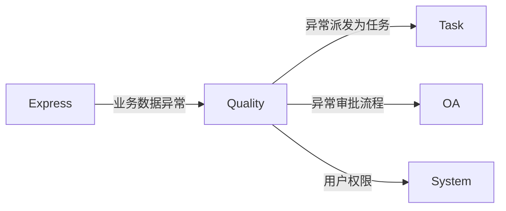
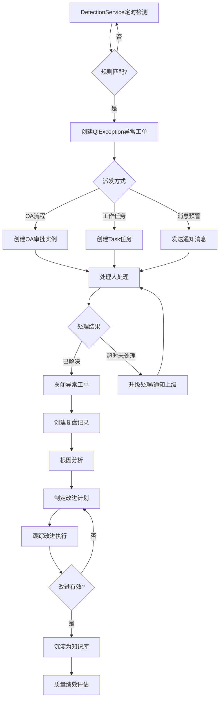
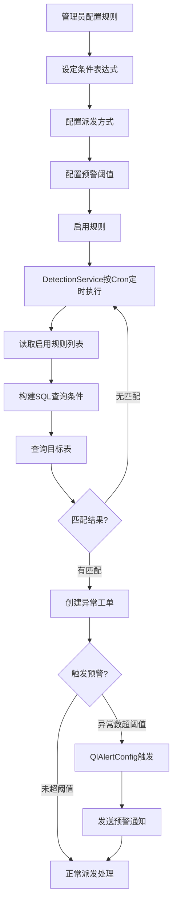
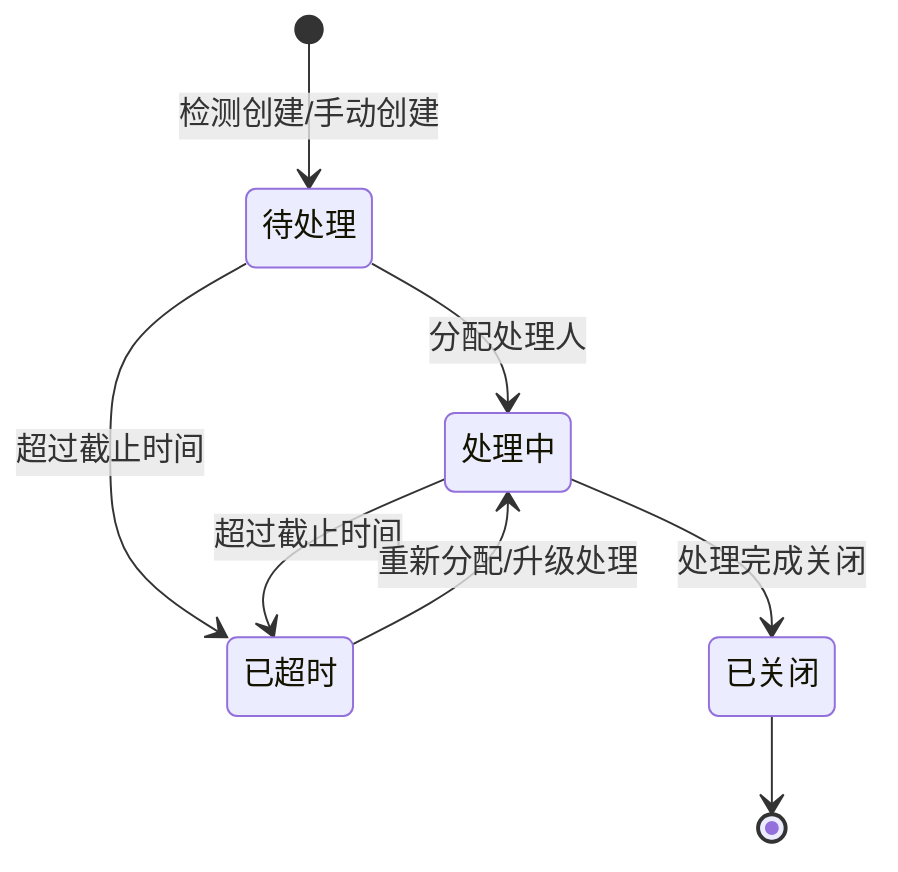

# Quality 质量中心模块设计文档

## 1. 模块职责与边界

### 1.1 核心职责

- **异常检测**：基于规则引擎自动扫描业务数据，发现异常并创建异常工单
- **规则管理**：配置异常检测规则，支持条件表达式与多条件AND/OR组合
- **异常派发与处理**：异常工单按派发方式（OA流程/工作任务/消息预警）分发处理
- **复盘改进**：异常处理后进行根因分析、改进计划跟踪
- **知识沉淀**：将异常处理经验转化为知识库文章
- **质量绩效**：按维度评估团队/个人的异常处理质量

### 1.2 不负责的内容（明确边界）

| 边界外内容 | 归属模块 |
|---|---|
| 审批流程管理 | OA |
| 任务分配与项目管理 | Task |
| 用户权限、角色、菜单管理 | System |

### 1.3 与其他模块的依赖关系



- **Task**：异常可派发为Task任务（FDispatchMethod=1），关联跟踪处理进度
- **OA**：异常可通过OA审批流程处理（FDispatchMethod=0）
- **System**：用户权限与组织架构查询
- **Express**：作为被检测的业务数据来源

### 1.4 目录结构

```
src/STOTOP.Module.Quality/
├── Configurations/      # EF Core实体配置（13个）
├── Controllers/         # API控制器（9个）
├── Dtos/                # 数据传输对象（9个）
├── Entities/            # 领域实体（13个）
├── EventHandlers/       # 领域事件处理器
├── Events/              # 领域事件定义
└── Services/            # 业务服务（按子包划分）
    ├── Alert/           # 预警服务
    ├── CarrierDashboard/ # 承运商质量看板服务（CarrierQualityDashboardService）
    ├── Dashboard/       # 仪表板服务
    ├── Detection/       # 检测服务
    ├── Dispatch/        # 派发服务
    ├── Exception/       # 异常管理服务
    ├── Knowledge/       # 知识库服务
    ├── Performance/     # 绩效评估服务
    ├── Review/          # 复盘服务
    ├── Rule/            # 规则管理服务
    └── Unification/     # 统一质控服务（QualityUnificationService/MasterDataMatcher 等）
```

---

## 2. 数据库表设计

### 2.1 异常管理核心（2张表）

#### QlException — 异常工单表

| 字段名 | 类型 | 说明 |
|---|---|---|
| FID | BIGINT PK | 主键 |
| FExceptionNo | NVARCHAR(20) | 异常编号（唯一，自动生成） |
| FTitle | NVARCHAR(200) | 异常标题 |
| FDescription | NVARCHAR(2000) | 异常描述 |
| FType | INT | 异常类型：0=数据异常, 1=流程超时, 2=规则违规 |
| FStatus | INT | 状态：0=待处理, 1=处理中, 2=已超时, 3=已关闭 |
| FPriority | INT | 优先级：0=低, 1=中, 2=高, 3=紧急 |
| FRuleId | BIGINT FK | 触发规则ID（可空，手动创建时为空） |
| FSource | NVARCHAR(100) | 异常来源（可空） |
| FRelatedModule | NVARCHAR(50) | 关联模块（可空） |
| FRelatedEntityId | BIGINT | 关联实体ID（可空） |
| FAssigneeId | BIGINT | 处理人ID（可空） |
| FDispatchMethod | INT | 派发方式：0=OA流程, 1=工作任务, 2=消息预警（可空） |
| FDispatchEntityId | BIGINT | 派发实体ID（OA实例ID/Task任务ID，可空） |
| FDeadline | DATETIME2 | 处理截止时间（可空） |
| FClosedTime | DATETIME2 | 关闭时间（可空） |
| FOrgId | BIGINT | 组织ID |
| FCreatorId | BIGINT | 创建人ID |
| FCreateTime | DATETIME2 | 创建时间 |
| FUpdateTime | DATETIME2 | 更新时间 |

#### QlExceptionLog — 异常操作日志表

| 字段名 | 类型 | 说明 |
|---|---|---|
| FID | BIGINT PK | 主键 |
| FExceptionId | BIGINT FK | 关联异常工单 |
| FOperatorId | BIGINT | 操作人ID |
| FAction | NVARCHAR(50) | 操作类型 |
| FRemark | NVARCHAR(500) | 操作备注（可空） |
| FFromStatus | INT | 原状态（可空） |
| FToStatus | INT | 新状态（可空） |
| FCreateTime | DATETIME2 | 操作时间 |

### 2.2 规则检测（2张表）

#### QlRule — 检测规则表

| 字段名 | 类型 | 说明 |
|---|---|---|
| FID | BIGINT PK | 主键 |
| FRuleName | NVARCHAR(100) | 规则名称 |
| FBusinessLine | NVARCHAR(50) | 业务线 |
| FConditionExpression | NVARCHAR(500) | 条件表达式（如"weight > 100 AND status = 'pending'"，可空） |
| FDispatchMethod | INT | 默认派发方式：0=OA流程, 1=工作任务, 2=消息预警 |
| FDispatchTarget | NVARCHAR(200) | 派发目标（可空） |
| FDefaultPriority | INT | 默认优先级 |
| FTimeoutHours | INT | 超时小时数（默认24） |
| FStatus | INT | 状态：是否启用（默认1） |
| FDescription | NVARCHAR(500) | 规则描述（可空） |
| FOrgId | BIGINT | 组织ID |
| FCreatorId | BIGINT | 创建人ID |
| FCreatedTime | DATETIME2 | 创建时间 |
| FUpdatedTime | DATETIME2 | 更新时间（可空） |

#### QlRuleCondition — 规则条件明细表

| 字段名 | 类型 | 说明 |
|---|---|---|
| FID | BIGINT PK | 主键 |
| FRuleId | BIGINT FK | 关联规则 |
| FFieldName | NVARCHAR(100) | 字段名 |
| FOperator | NVARCHAR(20) | 操作符：=, !=, >, <, >=, <=, LIKE, IN, IS NULL |
| FThreshold | NVARCHAR(500) | 阈值/比较值 |
| FLogicRelation | NVARCHAR(10) | 与下一条件逻辑关系：AND/OR |
| FSort | INT | 排序号（决定条件计算顺序） |

### 2.3 预警配置（1张表）

#### QlAlertConfig — 预警配置表

> 注：该实体 C# 属性名直接用全中文（历史遗留，未按"F+英文 PascalCase"约定），列名与属性同名。

| 字段名 | 类型 | 说明 |
|---|---|---|
| FID | BIGINT PK | 主键 |
| F配置名称 | NVARCHAR(100) | 预警名称 |
| F阈值类型 | NVARCHAR(50) | 阈值类型：count=数量, rate=比率, time=时间 |
| F阈值 | DECIMAL(18,4) | 阈值 |
| F通知方式 | NVARCHAR(50) | 通知方式 |
| F通知对象 | NVARCHAR | 通知对象（可空） |
| F状态 | INT | 状态：是否启用（默认1） |
| FOrgId | BIGINT | 组织ID |
| F创建时间 | DATETIME2 | 创建时间 |

### 2.4 复盘改进（2张表）

#### QlReview — 复盘记录表

| 字段名 | 类型 | 说明 |
|---|---|---|
| FID | BIGINT PK | 主键 |
| FExceptionId | BIGINT FK | 关联异常工单 |
| FTitle | NVARCHAR(200) | 复盘标题 |
| FRootCause | NVARCHAR(2000) | 根因分析（可空） |
| FImpactAnalysis | NVARCHAR(2000) | 影响分析（可空） |
| FConclusion | NVARCHAR(2000) | 结论与总结（可空） |
| FCreatorId | BIGINT | 复盘人ID |
| FReviewDate | DATETIME2 | 复盘日期 |
| FOrgId | BIGINT | 组织ID |
| FCreateTime | DATETIME2 | 创建时间 |
| FUpdateTime | DATETIME2 | 更新时间 |

#### QlReviewImprovement — 改进项表

| 字段名 | 类型 | 说明 |
|---|---|---|
| FID | BIGINT PK | 主键 |
| FReviewId | BIGINT FK | 关联复盘记录 |
| FContent | NVARCHAR(500) | 改进项内容 |
| FAssigneeId | BIGINT | 责任人ID（可空） |
| FDeadline | DATETIME2 | 截止日期（可空） |
| FCompleted | BIT | 是否已完成 |
| FCompletedTime | DATETIME2 | 实际完成时间（可空） |
| FSortOrder | INT | 排序号 |

### 2.5 知识积累（1张表）

#### QlKnowledge — 质量知识库表

| 字段名 | 类型 | 说明 |
|---|---|---|
| FID | BIGINT PK | 主键 |
| FTitle | NVARCHAR(200) | 知识标题 |
| FContent | NVARCHAR(MAX) | 知识内容（富文本） |
| FCategory | NVARCHAR(50) | 分类（可空） |
| FTags | NVARCHAR(200) | 标签（逗号分隔，可空） |
| FRelatedExceptionId | BIGINT FK | 关联异常ID（可空） |
| FRelatedReviewId | BIGINT FK | 关联复盘ID（可空） |
| FViewCount | INT | 浏览次数 |
| FCreatorId | BIGINT | 作者ID |
| FOrgId | BIGINT | 组织ID |
| FCreateTime | DATETIME2 | 创建时间 |
| FUpdateTime | DATETIME2 | 更新时间 |

### 2.6 绩效评估（1张表）

#### QlPerformance — 质量绩效表

| 字段名 | 类型 | 说明 |
|---|---|---|
| FID | BIGINT PK | 主键 |
| FUserId | BIGINT | 被评估人ID |
| FPeriod | NVARCHAR(20) | 评估周期 |
| FExceptionCount | INT | 总异常数 |
| FResolvedCount | INT | 已解决数 |
| FOverdueCount | INT | 超期数 |
| FScore | DECIMAL(5,2) | 综合得分 |
| FRemark | NVARCHAR(500) | 备注（可空） |
| FOrgId | BIGINT | 组织ID |
| FCreateTime | DATETIME2 | 创建时间 |
| FUpdateTime | DATETIME2 | 更新时间 |

---

## 3. 规则引擎

### 3.1 条件表达式

规则支持通过 `FConditionExpression` 定义检测条件：

```
// 单条件
weight > 100

// 多条件组合
weight > 100 AND status = 'pending'

// 复杂条件
(amount > 50000 OR priority = '紧急') AND created_days > 3
```

### 3.2 条件组合（QlRuleCondition）

通过 `QlRuleCondition` 表以结构化方式定义多条件组合：

| 序号 | 字段名 | 操作符 | 值 | 逻辑关系 |
|---|---|---|---|---|
| 1 | weight | > | 100 | AND |
| 2 | status | = | pending | AND |
| 3 | created_days | > | 3 | — |

### 3.3 内置业务线

| 业务线编码 | 说明 | 检测目标 |
|---|---|---|
| express_outbound | 快递出港 | 运单数据、计费结果 |
| express_inbound | 快递进港 | 进港运单、签收数据 |
| order_processing | 订单处理 | 订单状态、处理时效 |
| crm | 客户关系 | 客户跟进、商机转化 |
| finance | 财务管理 | 账单异常、对账差异 |

### 3.4 自动检测流程

```
DetectionService（定时/手动触发）
  → 读取启用的 QlRule 列表
  → 遍历规则，按 FConditionExpression/QlRuleCondition 构建查询
  → 查询业务线对应数据匹配
  → 匹配结果 → 创建 QlException
  → 按 FDispatchMethod 派发处理
    → 0: 创建OA审批流程实例
    → 1: 创建Task模块任务
    → 2: 发送预警消息通知
```

### 3.5 质量评分公式

```
综合得分 = 处理完成率 × 50 + 处理及时率 × 20 + 处理质量评分 × 30

其中：
  处理完成率 = (总异常数 - 超期数) / 总异常数 × 100
  处理及时率 = 按时关闭数 / 已关闭总数 × 100
  处理质量评分 = 复盘改进有效率 × 100
```

---

## 4. API接口清单（9个Controller）

### 4.1 异常管理

- `GET /api/quality/exceptions` — 获取异常工单列表（支持筛选/分页）
- `GET /api/quality/exceptions/{id}` — 获取异常工单详情
- `POST /api/quality/exceptions` — 手动创建异常工单
- `PUT /api/quality/exceptions/{id}` — 更新异常工单
- `DELETE /api/quality/exceptions/{id}` — 删除异常工单
- `POST /api/quality/exceptions/{id}/dispatch` — 派发异常工单
- `POST /api/quality/exceptions/{id}/close` — 关闭异常工单
- `POST /api/quality/exceptions/{id}/reassign` — 转派异常工单
- `GET /api/quality/exceptions/count-by-status` — 异常状态统计

### 4.2 规则管理

- `GET /api/quality/rules` — 获取规则列表
- `GET /api/quality/rules/{id}` — 获取规则详情（含条件明细）
- `POST /api/quality/rules` — 创建规则
- `PUT /api/quality/rules/{id}` — 更新规则
- `DELETE /api/quality/rules/{id}` — 删除规则
- `POST /api/quality/rules/{id}/toggle` — 启用/禁用规则

### 4.3 复盘管理

- `GET /api/quality/reviews` — 获取复盘列表
- `GET /api/quality/reviews/{id}` — 获取复盘详情
- `POST /api/quality/reviews` — 创建复盘记录
- `PUT /api/quality/reviews/{id}` — 更新复盘记录
- `DELETE /api/quality/reviews/{id}` — 删除复盘记录
- `GET /api/quality/reviews/stats` — 复盘统计
- `GET /api/quality/improvements` — 改进项分页列表
- `PUT /api/quality/improvements/{id}` — 更新改进项
- `POST /api/quality/improvements/{id}/complete` — 完成改进项

### 4.4 知识库

- `GET /api/quality/knowledge` — 获取知识列表（支持分类/搜索）
- `GET /api/quality/knowledge/{id}` — 获取知识详情
- `POST /api/quality/knowledge` — 创建知识文章
- `PUT /api/quality/knowledge/{id}` — 更新知识文章
- `DELETE /api/quality/knowledge/{id}` — 删除知识文章
- `GET /api/quality/knowledge/categories` — 获取知识库分类列表
- `GET /api/quality/knowledge/tags` — 获取知识库标签列表
- `GET /api/quality/knowledge/stats` — 知识库统计

### 4.5 绩效评估

- `GET /api/quality/performance` — 获取绩效记录列表（分页）
- `GET /api/quality/performance/my` — 获取我的绩效
- `GET /api/quality/performance/stats` — 绩效统计
- `GET /api/quality/performance/ranking` — 绩效排名
- `GET /api/quality/performance/trend` — 绩效趋势

### 4.6 仪表板

- `GET /api/quality/dashboard/stats` — 获取看板统计数据
- `GET /api/quality/dashboard/recent` — 获取最近异常列表
- `GET /api/quality/dashboard/trend` — 获取趋势数据
- `GET /api/quality/dashboard/type-dist` — 获取类型分布
- `GET /api/quality/dashboard/priority-dist` — 获取优先级分布
- `GET /api/quality/dashboard/analysis/trend` — 异常趋势分析
- `GET /api/quality/dashboard/analysis/efficiency` — 处理效率分析
- `GET /api/quality/dashboard/analysis/source` — 来源分布分析
- `GET /api/quality/dashboard/analysis/handler-stats` — 处理人排名统计

### 4.7 预警配置

- `GET /api/quality/alert-configs` — 获取预警配置列表
- `GET /api/quality/alert-configs/{id}` — 获取预警配置详情
- `POST /api/quality/alert-configs` — 创建预警配置
- `PUT /api/quality/alert-configs/{id}` — 更新预警配置
- `DELETE /api/quality/alert-configs/{id}` — 删除预警配置
- `POST /api/quality/alert-configs/{id}/toggle` — 启用/禁用预警配置

### 4.8 承运商质量看板（CarrierQualityDashboardController，路由前缀 `api/quality/carrier-dashboard`）

- `GET /api/quality/carrier-dashboard/network/kpi` — 网点 KPI
- `GET /api/quality/carrier-dashboard/network/trend` — 网点趋势
- `GET /api/quality/carrier-dashboard/network/domain-distribution` — 质量域分布
- `GET /api/quality/carrier-dashboard/network/fee-by-domain` — 按质量域考核金额
- `GET /api/quality/carrier-dashboard/network/options` — 网点选项
- `GET /api/quality/carrier-dashboard/employee/rank` — 员工排名
- `GET /api/quality/carrier-dashboard/employee/metrics` — 员工指标分页
- `GET /api/quality/carrier-dashboard/employee/{empNo}/timeline` — 员工事件时间线
- `GET /api/quality/carrier-dashboard/events` — 问题件列表
- `GET /api/quality/carrier-dashboard/pending-count` — 待认领条数
- `GET /api/quality/carrier-dashboard/events/export` — 问题件 CSV 导出

### 4.9 统一质控（UnificationController，路由前缀 `api/quality/unify`）

- `GET /api/quality/unify/pending-employees` — 待认领员工聚合
- `POST /api/quality/unify/run` — 手动归一（整批 upsert）
- `POST /api/quality/unify/rematch` — 重跑回填未匹配历史事件

---

## 5. 业务流程图

### 5.1 异常处理全流程



### 5.2 规则与预警流程



### 5.3 异常状态流转



---

## 6. 模块关联总览

| 关联模块 | 关联方式 | 说明 |
|---|---|---|
| Task | QlException.FDispatchEntityId → TmTask | 异常派发为任务，Task模块跟踪处理 |
| OA | QlException.FDispatchEntityId → BpmProcessInstance | 异常通过OA审批流程处理 |
| System | 用户/角色/权限依赖 | 处理人分配、权限控制 |
| Express | 业务数据来源 | 检测出港/进港运单异常 |
| Finance | 财务数据来源 | 检测账单、对账差异异常 |
| CRM | 客户数据来源 | 检测客户跟进、商机转化异常 |
