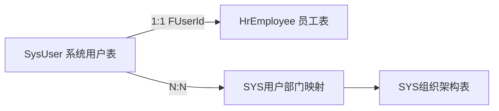
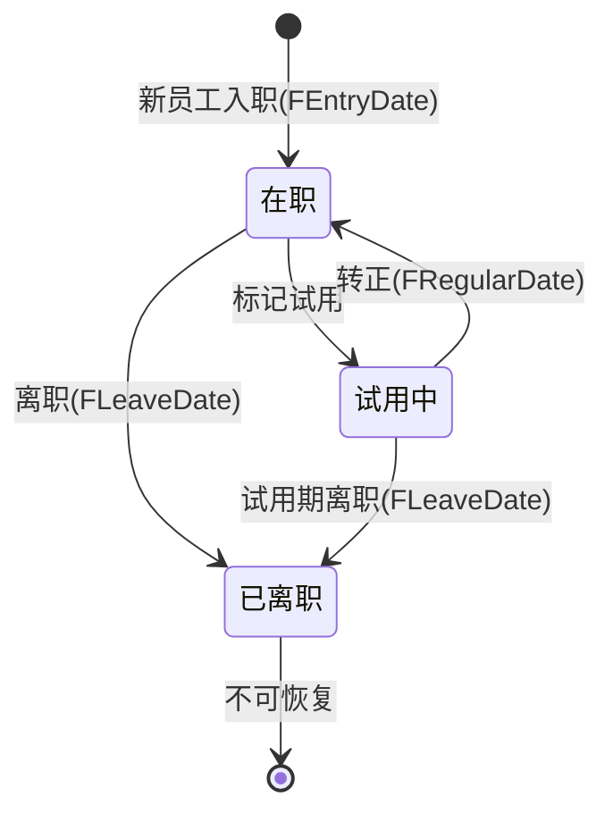
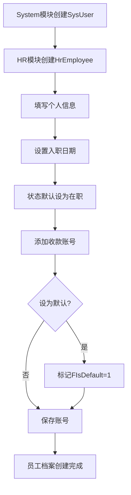

# HR 人力资源模块设计文档

## 1. 模块职责与边界

### 1.1 核心职责

- **员工基本信息管理**：员工个人档案维护（姓名、性别、身份证、联系方式、学历、婚姻状况、地址、紧急联系人等）
- **员工生命周期**：试用→转正→在职→离职状态流转管理
- **收款账号管理**：员工银行卡、支付宝、微信等收款账号维护，支持默认账号设置

> **当前阶段说明**：HR模块目前处于基础阶段，仅包含员工信息和收款账号两张表，后续将逐步扩展考勤、薪资等功能。

### 1.2 不负责的内容（明确边界）

| 边界外内容 | 归属模块 |
|---|---|
| 用户账号/密码/权限/登录 | System（SysUser） |
| 部门组织架构管理 | System（SYS组织架构表） |
| 考勤打卡（未来可能在OA） | OA |
| 薪资核算与发放 | Finance |
| 审批流程 | OA |
| 钉钉用户/部门同步 | System/DingTalk（未来规划） |

### 1.3 与System模块的关系



**核心设计原则**：
- **SysUser** 负责：账号、密码、权限、角色、登录信息
- **HrEmployee** 负责：个人信息、联系方式、学历、在职状态
- 两者通过 `HrEmployee.FUserId → SysUser.FID` 建立 **1:1唯一** 关联
- 组织架构由System模块统一管理，HR通过关联路径查询：`HrEmployee.FUserId → SysUser → SysUserDept → SysOrg`

### 1.4 目录结构

```
src/STOTOP.Module.HR/
├── Configurations/      # EF Core实体配置（HrEmployeeConfiguration / HrEmployeePaymentAccountConfiguration）
├── Controllers/         # API控制器（EmployeeController）
├── Dtos/                # 数据传输对象（EmployeeDtos）
├── Entities/            # 领域实体（HrEmployee / HrEmployeePaymentAccount）
└── Services/            # 业务服务（IEmployeeService 接口 + EmployeeService 实现）
```

---

## 2. 数据库表设计

### 2.1 HrEmployee — HR员工表（表名 `HR员工`）

> 字段名列为 C# 实体属性（`F+PascalCase`）；数据库列名为对应中文 `F+中文`（由 `HrEmployeeConfiguration.HasColumnName` 映射），见“数据库列名”列。

| 字段名（C#属性） | 类型 | 数据库列名 | 说明 |
|---|---|---|---|
| FID | BIGINT PK | FID | 主键 |
| FUID | NVARCHAR(64) | FUID | 员工唯一编号（默认 GUID，唯一） |
| FUserId | BIGINT FK | F用户ID | 关联SysUser（1:1唯一，FK→SysUser.FID） |
| FName | NVARCHAR(50) | F姓名 | 姓名 |
| FGender | NVARCHAR(10) | F性别 | 性别 |
| FBirthDate | DATE | F出生日期 | 出生日期 |
| FIdCardNumber | NVARCHAR(20) | F身份证号 | 身份证号 |
| FPhone | NVARCHAR(20) | F手机号 | 手机号 |
| FEthnicity | NVARCHAR(20) | F民族 | 民族 |
| FEducation | NVARCHAR(20) | F学历 | 学历：高中/大专/本科/硕士/博士 |
| FMaritalStatus | NVARCHAR(10) | F婚姻状况 | 婚姻状况 |
| FHomeAddress | NVARCHAR(200) | F现住地址 | 现住地址 |
| FHouseholdAddress | NVARCHAR(200) | F户籍地址 | 户籍地址 |
| FEmergencyContact | NVARCHAR(50) | F紧急联系人 | 紧急联系人姓名 |
| FEmergencyContactPhone | NVARCHAR(20) | F紧急联系人电话 | 紧急联系人电话 |
| FEmergencyContactRelation | NVARCHAR(20) | F紧急联系人关系 | 紧急联系人关系 |
| FEntryDate | DATE | F入职日期 | 入职日期 |
| FRegularDate | DATE | F转正日期 | 转正日期 |
| FLeaveDate | DATE | F离职日期 | 离职日期 |
| FEmployeeStatus | INT | F员工状态 | 在职状态：1=在职, 2=试用, 3=离职（默认1） |
| FRemark | NVARCHAR(500) | F备注 | 备注 |
| FCreateTime | DATETIME2 | F创建时间 | 创建时间（默认 GETDATE()） |
| FUpdateTime | DATETIME2 | F更新时间 | 更新时间（默认 GETDATE()） |

> 注：HrEmployee 仅继承 `BaseEntity`（`FID`），不含组织隔离 `FOrgId` 及 `FCreatorId/FModifierId/FIsDeleted` 等审计/软删除字段；仅有 `FCreateTime/FUpdateTime` 两个时间戳。

**索引**：

| 索引名 | 类型 | 字段 | 说明 |
|---|---|---|---|
| IX_HrEmployee_FUID | UNIQUE | FUID | 员工唯一编号唯一索引 |
| IX_HrEmployee_FUserId | UNIQUE | FUserId | 关联用户唯一索引（确保1:1） |

### 2.2 HrEmployeePaymentAccount — HR员工收款账号表（表名 `HR员工收款账号`）

| 字段名（C#属性） | 类型 | 数据库列名 | 说明 |
|---|---|---|---|
| FID | BIGINT PK | FID | 主键 |
| FEmployeeId | BIGINT FK | F员工ID | 员工ID（FK→HrEmployee.FID，级联删除） |
| FAccountType | NVARCHAR(20) | F账号类型 | 账号类型：bank_card=银行卡, alipay=支付宝, wechat=微信 |
| FAccountName | NVARCHAR(50) | F账号名称 | 户名 |
| FAccountNumber | NVARCHAR(50) | F账号 | 账号 |
| FBankName | NVARCHAR(50) | F银行名称 | 开户银行 |
| FBankBranch | NVARCHAR(100) | F支行名称 | 开户支行 |
| FIsDefault | INT | F是否默认 | 是否默认：0=否, 1=是（默认0） |
| FRemark | NVARCHAR(500) | F备注 | 备注 |
| FCreateTime | DATETIME2 | F创建时间 | 创建时间（默认 GETDATE()） |
| FUpdateTime | DATETIME2 | F更新时间 | 更新时间（默认 GETDATE()） |

> 收款账号经员工导航属性 `PaymentAccounts` 一并维护（创建/更新随 `EmployeeDto.PaymentAccounts` 子表同步），无独立外键索引配置。

---

## 3. 员工生命周期

### 3.1 状态定义

| FEmployeeStatus | 含义 | 说明 |
|---|---|---|
| 1 | 在职 | 新员工入职默认状态；试用期通过转正后亦为此状态 |
| 2 | 试用中 | 试用期员工 |
| 3 | 已离职 | 办理离职手续后，不可恢复 |

### 3.2 状态流转规则



**关键业务规则**：
- 入职时状态默认为 `在职(1)`，设置 `FEntryDate`
- 转正时状态变为 `在职(1)`，设置 `FRegularDate`
- 离职时状态变为 `已离职(3)`，设置 `FLeaveDate`，**状态不可恢复**
- 离职后不删除记录，仅标记状态，保留历史档案

---

## 4. API接口清单（EmployeeController，路由前缀 `api/hr/employees`）

### 4.1 员工管理

- `GET /api/hr/employees` — 分页查询员工列表（关键字按姓名/手机号/身份证号、员工状态筛选）
- `GET /api/hr/employees/{id}` — 获取员工详情（含收款账号子表）
- `POST /api/hr/employees` — 创建员工档案
- `PUT /api/hr/employees/{id}` — 更新员工信息（含在职状态字段，整体更新）
- `DELETE /api/hr/employees/{id}` — 删除员工（物理删除，级联删除收款账号）
- `GET /api/hr/employees/by-user/{userId}` — 按 SysUser 用户ID查询员工
- `GET /api/hr/employees/search-users` — 搜索尚未关联员工的可用用户（用于建档关联）
- `GET /api/hr/employees/all-enabled` — 获取全部在职员工扁平列表（供辅助核算关联）

> 收款账号无独立端点：作为员工详情的 `PaymentAccounts` 子表，随 `POST`/`PUT employees/{id}` 一并增删改；在职状态亦无独立 `/status` 端点，随 `PUT employees/{id}` 整体更新（含 `FLeaveDate` 等）。

---

## 5. 业务流程图

### 5.1 员工信息创建流程



### 5.2 员工状态流转流程

```mermaid
flowchart TD
    A[新员工入职] --> B[创建档案 状态默认=在职]
    B --> C[试用期工作]
    C --> D{试用评估}
    D -->|通过| E[PUT employees/&#123;id&#125; 转正]
    E --> F[状态=在职 设置FRegularDate]
    D -->|不通过| G[PUT employees/&#123;id&#125; 离职]
    G --> H[状态=已离职 设置FLeaveDate]
    F --> I[正常工作]
    I --> J{申请离职}
    J -->|是| K[PUT employees/&#123;id&#125; 离职]
    K --> H
    J -->|否| I
```



---

## 6. 与System模块的数据模型对比

| 维度 | SysUser（System模块） | HrEmployee（HR模块） |
|---|---|---|
| **定位** | 系统账号 | 员工档案 |
| **核心数据** | 用户名、密码、邮箱 | 姓名、身份证、手机、地址 |
| **权限相关** | 角色、菜单、权限 | 无 |
| **组织相关** | 通过SysUserDept关联部门 | 通过FUserId间接关联 |
| **登录功能** | 是 | 否 |
| **联系信息** | 邮箱（基础） | 手机、地址、紧急联系人 |
| **生命周期** | 启用/禁用 | 试用/在职/离职 |

---

## 7. 未来规划

| 功能方向 | 说明 | 可能归属 |
|---|---|---|
| 钉钉同步 | 部门/用户/打卡数据从钉钉同步 | System/DingTalk |
| 考勤管理 | 打卡记录、请假、加班、出差 | OA（审批驱动） |
| 薪资核算 | 薪资结构、计薪、发放 | Finance |
| 培训管理 | 培训计划、记录、证书 | HR（扩展） |
| 合同管理 | 劳动合同、续签提醒 | HR/Contract |
| 职级体系 | 职级、晋升通道 | HR（扩展） |
