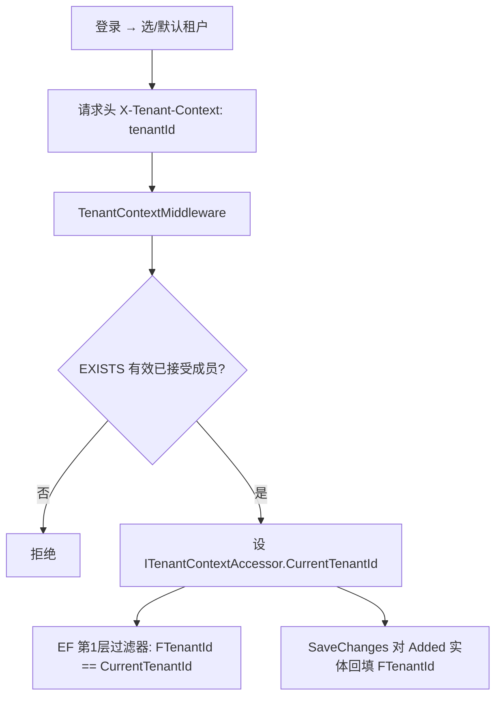
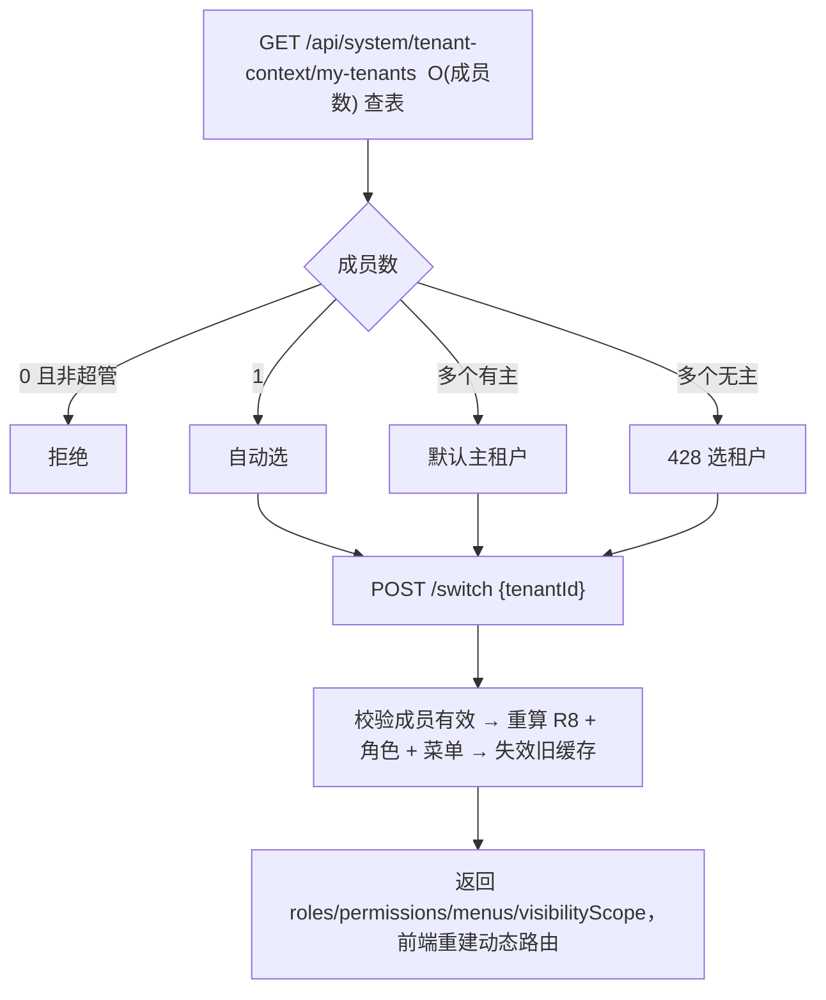

# 多租户组织 / 租户 / 身份 / 数据权限 重设计（拟议 · 未实施）

> **文档性质**：本文是面向 SaaS 演进的**目标态设计**，**尚未落地**，不代表当前运行边界。当前实现仍是单组织（`SysOrganization` + `FOrgId` 全局过滤器），详见 [03-system.md](03-system.md)。本文记录"应该建成什么样"与"如何从现状迁移"，供评审与分阶段实施参考。落地后再把已实现部分回写各模块文档。
>
> 命名遵循 STOTOP 规约：表名 = 模块前缀（大写英文）+ 中文；DB 列 `F+中文`；C# 属性 `F+PascalCase`；主键 `FID`（`BaseEntity`）；每表带组织/租户隔离、创建更新、并发令牌 `F版本号`、软状态 `F状态`。本文表格"字段"列写 C# 属性，"DB列"列写实际中文列名。

> **⚠️ v2 重大修订（2026-06-30）—— 租户 = 客户，不是固定的"区域公司"**
> 初版把"租户 = 区域公司"钉死，未考虑"集团客户"形态。现纠正：**租户 = 客户 / 订阅实体**，硬隔离（R9）发生在**客户之间**；客户形态可变——可以是**集团**（如 MDSTO，管多家区域公司）、单个**区域公司**、或单个**网点公司**，租户根节点类型随之而定。租户内是**深度可变**的组织树，节点类型增一层 **集团**：`集团 / 区域公司 / 中心 / 网点公司 / 部门 / 班组`。**租户内**的区域公司/网点公司之间用 **R8 数据范围**隔离（集团总部可跨区域汇总、区域公司用户只看本区域；已定），不是硬墙。**当前生产库整棵树都属 MDSTO 一个客户 = 一个租户**，故存量回填 `F租户ID` 全归该租户、无组织回溯歧义；多租户隔离在其他客户经 SaaS 上线时才行使。下文凡"区域公司=租户 / 区域公司间严格隔离"的旧表述，一律按本修订理解为"客户=租户 / 客户间严格隔离"。

---

## 1. 设计目标与业务约束

把现有单组织模型升级为 **SaaS 多租户**，**以客户（订阅实体，可为集团/区域公司/网点公司）为租户**做客户间严格隔离（见顶部 v2 修订）。九条业务约束（R1–R9）：

| 编号 | 约束 |
|------|------|
| R1 | 网点本质是品牌总部下设"区域管理单元"的账号，由一家公司运营。一家公司对**单一品牌**至多经营一个网点，但可跨多个品牌各经营一个。即 `(网点公司, 品牌) → 至多一个网点`；网点公司 ↔ 网点 = 1:N。 |
| R2 | 财务辅助核算"经营单元"对应"网点公司"；经营单元从网点公司**派生**，不独立手工维护。 |
| R3 | 多家网点公司组成一个"区域公司"（如太仓美申辖城区/浏河/沙溪/南郊公司）。区域公司本身还下设支持部门（财务部/人资部/综合部等）。 |
| R4 | 一个网点公司 / 一个或多个区域公司可对应一套钉钉或企业微信组织；用户账号需与钉钉/企微打通处理待办。 |
| R5 | 未来以 SaaS 方式开放给其他网点公司或区域公司使用。 |
| R6 | 租户切换以**客户/租户**为单位；用户属多个**独立客户（租户）**时允许切换。集团租户内的区域公司间是 R8 范围筛选，非租户切换。 |
| R7 | 区域公司可下设**网点公司**、**中心**、**部门**（变深度）。中心既可作管理层分组部门（`区域公司→中心→部门→班组`），也可作**多网点公司分组**（`区域公司→中心→网点公司→部门→班组`）。网点公司下设部门/班组。简单形态 `区域公司→部门→班组`。 |
| R8 | 用户在区域公司直属部门下 → 数据权限默认整个区域公司；在网点公司下设部门下 → 数据可视范围最大到该网点公司。 |
| R9 | **以客户（订阅实体）为最大租户，客户/租户之间数据严格隔离**（见 v2 修订）。集团租户内的区域公司之间用 R8 数据范围隔离（总部可汇总），非硬隔离。 |

**概念区分（务必厘清）**：
- **租户 = 客户/订阅实体**（可为集团/区域公司/网点公司）；"区域公司"是组织层级/角色，**不等于**租户。二者均 ≠ 网点所代表的"品牌区域管理单元"（品牌侧概念）。
- 品牌（申通/中通/圆通…）是**平台级共享参考数据**，跨租户共享，不属于任一租户。
- 网点公司是**真实组织单位**（有部门、有人、有数据可视边界），不只是财务维度标签。
- 平台/超管层在租户之上（用于 SaaS 开通/计费），但业务数据按租户严格隔离。

---

## 2. 已锁定决策

| # | 决策 | 含义 |
|---|------|------|
| D1 | **单父归属 + 租户=客户(v2)** | 租户=客户/订阅实体（可为集团/区域公司/网点公司，见 v2 修订）；硬隔离在客户间。租户内一家网点公司只属一个区域公司（或直属租户根），单父邻接树成立；集团租户内区域公司间用 R8 数据范围（总部可汇总，已定），非硬墙。单库行级隔离最简。 |
| D2 | **账套绑定双模（租户可配）** | `PLT租户.FAccountSetBindMode`：`1=按区域公司`（账套挂租户，网点公司靠辅助核算经营单元区分）/ `2=按网点公司`（一公司一账套）。`FIN账套.FCompanyId` 可空。 |
| D3 | **同租户钉钉 + 企微都要** | `IDP企业租户映射` 首期即按 N:N；`PLT租户.FDefaultTodoChannel` 决定双 corp 待办分发渠道。 |
| D4 | **数据隔离最小粒度 = 网点公司** | 强制可视边界（R8）只到 COMPANY；网点公司内按品牌/部门看数据走**数据筛选**（查询 WHERE/GROUP BY），不是权限边界。不建 OUTLET 级范围、不建可视网点节点表。 |
| D5 | **中心级范围（运营中心）** | 中心作"多网点公司分组"（运营中心/片区）时，其直属用户可视 = **该中心闭包下所有网点公司**（CENTER 级，介于 TENANT 与 COMPANY）。运营中心内**不再细分可视**，要看部分公司靠筛选（与 D4 同向）。纯管理中心（子树无网点公司）用户落 TENANT。 |
| D6 | **全租户写权限二人复核** | `(Write, TENANT)` 手工授权须**二人复核**才生效，审批人 = 租户内两名管理员（或租户管理员 + 申请人直属上级），平台方不插手租户内部授权；`SYS数据范围授权.FApprovalId` 记复核单。 |
| D7 | **冻结期放行结账只读** | 欠费冻结期白名单除登录/续费/轻量只读外，**额外放行财务结账类只读**（结账视图、科目余额等）；**批量导出/全量拉数仍禁**。 |

---

## 3. 模型总览

### 3.1 四层同心隔离圈层（外→内，隔离强度递减）

```
┌─ 平台层 (PLT)         租户之上。SaaS 开通/计费/超管。脱离租户过滤器，独立路由 /api/platform/*
│ ┌─ 共享参考层 (REF)    品牌、行政区划。ISharedReference 独立过滤器（不是 FTenantId=0）
│ │ ┌─ 租户层 (=区域公司)  R9 隔离根。一切业务数据钉死 FTenantId，fail-closed 硬墙
│ │ │ ┌─ 组织内层 (SYS组织)   区域公司根 / 中心 / 网点公司 / 部门 / 班组（变深度），喂 R8
│ │ │ │ └─ 资源层 (FIN账套/经营单元)  账套级 RBAC 边界，账套∈租户强校验
```

### 3.2 两列两层过滤器（核心决策）

根治现状 `FOrgId` 单列承载"隔离 + 归属"双语义的问题，拆成两列两层：

| 列（DB / C#） | 语义 | 过滤器层 | 取值口径 |
|---|---|---|---|
| `F租户ID` / `FTenantId` | R9 隔离根 = 区域公司 | **第 1 层：fail-closed 硬墙，无上下文即拒，不认 null、不认 0** | 当前切换到的区域公司 |
| `F组织ID` / `FOrgId` | 租户内归属节点（R8 范围软筛输入） | **第 2 层：按 R8 软筛，产出节点集必被硬墙二次夹逼 ∈ 当前租户子树** | 部门 / 网点公司节点 |

---

## 4. 核心实体与数据库表设计

> 隔离接口三种：`ITenantScoped`（带 `F租户ID`，进第 1 层硬墙）、`IOrgScoped`（带 `F组织ID`，第 2 层范围输入，**不再做隔离**）、`ISharedReference`（跨租户共享，独立过滤器）。平台级实体不带租户列。

### 4.1 平台层（PLT）

#### PLT租户 — 区域公司 = 租户

| 字段(C#) | 类型 | DB列 | 说明 |
|---|---|---|---|
| FID | bigint PK | FID | 主键 |
| FName | nvarchar(100) | F名称 | 区域公司名称（如"太仓美申"） |
| FCode | nvarchar(50) | F编号 | 租户编号（唯一） |
| FRootOrgId | bigint | F根组织ID | 对应 `SYS组织` 的区域公司根节点 |
| FAccountSetBindMode | int | F账套绑定模式 | **D2**：1=按区域公司 / 2=按网点公司 |
| FDefaultTodoChannel | int | F默认待办渠道 | **D3**：1=钉钉 / 2=企微 / 3=双推 |
| FPlanId | bigint | F套餐ID | → PLT套餐 |
| FActivatedAt | datetime2 | F开通时间 | |
| FExpireAt | datetime2 | F到期时间 | |
| FStatus | int | F状态 | 试用/正式/停用/欠费冻结 |
| FRowVersion | rowversion | F版本号 | 并发令牌 |

#### PLT套餐 / PLT订阅

`PLT套餐`：`FName`、`FMaxUsers→F最大用户数`、`FMaxOutlets→F最大网点数`、`FModuleFlags→F模块开关`(JSON)。
`PLT订阅`：`FTenantId`、`FPlanId`、`FPeriodStart→F周期起`、`FPeriodEnd→F周期止`、`FStatus`。

### 4.2 共享参考层（REF，`ISharedReference`）

#### REF品牌 — 申通/中通/圆通…（跨租户共享）

| 字段(C#) | 类型 | DB列 | 说明 |
|---|---|---|---|
| FID | bigint PK | FID | 主键 |
| FCode | nvarchar(50) | F编码 | 品牌编码 |
| FName | nvarchar(100) | F名称 | 品牌名称 |
| FShortName | nvarchar(50) | F简称 | |
| FStatus | int | F状态 | |

`REF行政区划`：`FCode`、`FName`、`FParentCode→F父级编码`。

### 4.3 组织内层（SYS）

#### SYS组织 — 唯一组织树（五类节点）

| 字段(C#) | 类型 | DB列 | 说明 |
|---|---|---|---|
| FID | bigint PK | FID | 主键 |
| FTenantId | bigint | F租户ID | R9 隔离键 |
| FName | nvarchar(100) | F名称 | |
| FCode | nvarchar(50) | F编码 | |
| FParentId | bigint | F父节点ID | 邻接表；区域公司根的父为 0 |
| FKind | int | F组织类别 | **0=集团 / 1=区域公司 / 2=网点公司 / 3=中心 / 4=部门 / 5=班组**；**租户根类型随客户而定**(集团/区域公司/网点公司，见 v2 修订)；中心可分组网点公司(运营中心)或部门(管理中心)，部门/班组为管理叶层，变深度 |
| FCompanyId | bigint? | F所属网点公司ID | 节点所属网点公司（在某网点公司子树内时填，供财务/经营单元归属）；不在任何网点公司下为空。R8 范围根另由 `FScopeRootId` 物化 |
| FScopeRootType | int | F范围根类型 | 物化：1=Tenant(区域公司) / 2=Center(中心,多网点公司) / 3=Company(网点公司) |
| FScopeRootId | bigint | F范围根ID | 物化范围根节点 |
| FPath | nvarchar(400) | F路径 | 物化如 `/1/8/12/`，加速子树 |
| FManagerId | bigint? | F负责人ID | |
| FSort | int | F排序 | |
| FStatus | int | F状态 | |

> **合法树形（DB CHECK + 闭包触发器强制，支持跳级变深度）**：
> - 区域公司(根) 子 ∈ {中心, 网点公司, 部门}
> - 中心 子 ∈ {网点公司, 部门}（中心既可分组网点公司=运营中心，也可分组部门=管理中心）
> - 网点公司 子 ∈ {部门}
> - 部门 子 ∈ {班组}；班组为叶
>
> 支持四种形态：`区域公司→网点公司→部门→班组`、`区域公司→中心→部门→班组`、`区域公司→部门→班组`、`区域公司→中心→网点公司→部门→班组`。范围根 `FScopeRootId`/`FScopeRootType` 在建树期物化、树变更时同事务重算，保证任一节点范围根唯一确定（见 §7.1）。

#### SYS组织闭包 — 闭包表

| 字段(C#) | 类型 | DB列 | 说明 |
|---|---|---|---|
| FAncestorId | bigint | F祖先ID | |
| FDescendantId | bigint | F后代ID | |
| FDepth | int | F层差 | O(1) 取祖先链 / 后代子树，供 R8 与阿米巴上卷 |
| FTenantId | bigint | F租户ID | |

#### SYS网点公司 — R1/R2 真实运营公司（与 Company 节点 1:1）

| 字段(C#) | 类型 | DB列 | 说明 |
|---|---|---|---|
| FID | bigint PK | FID | 主键 |
| FTenantId | bigint | F租户ID | |
| FOrgNodeId | bigint | F组织节点ID | ↔ `SYS组织` 的 Company 节点（1:1，事务联动） |
| FName | nvarchar(100) | F名称 | |
| FCreditCode | nvarchar(50)? | F统一社会信用代码 | 可空 |
| FStatus | int | F状态 | |
| FRowVersion | rowversion | F版本号 | |

#### SYS用户 — 全局唯一身份（不带租户列）

| 字段(C#) | 类型 | DB列 | 说明 |
|---|---|---|---|
| FID | bigint PK | FID | 主键 |
| FAccount | nvarchar(50) | F账号 | 唯一 |
| FPasswordHash | nvarchar(256) | F密码哈希 | bcrypt |
| FPhone | nvarchar(20) | F手机号 | 唯一 |
| FEmail | nvarchar(100)? | F邮箱 | |
| FIsPlatformAdmin | bit | F是否平台超管 | 替代 `account=="admin"` 硬旁路 |
| FStatus | int | F状态 | |

#### SYS租户成员 — 用户 ↔ 租户（R6 切换依据）

| 字段(C#) | 类型 | DB列 | 说明 |
|---|---|---|---|
| FID | bigint PK | FID | 主键 |
| FUserId | bigint | F用户ID | |
| FTenantId | bigint | F租户ID | |
| FIsPrimary | bit | F是否主租户 | 多租户默认进入哪个 |
| FInviteStatus | int | F邀请状态 | 待确认/已接受/已拒绝（加入须被邀请人显式接受） |
| FInvitedBy | bigint? | F邀请人 | |
| FJoinedAt | datetime2? | F加入时间 | |
| FStatus | int | F状态 | 唯一索引 `(F用户ID, F租户ID)` |

#### SYS任职 — 成员在组织节点的任职（喂 R8）

| 字段(C#) | 类型 | DB列 | 说明 |
|---|---|---|---|
| FID | bigint PK | FID | 主键 |
| FTenantId | bigint | F租户ID | |
| FMemberId | bigint | F成员ID | → SYS租户成员 |
| FOrgId | bigint | F组织ID | 任职节点 |
| FDirectSuperiorId | bigint? | F直属上级ID | |
| FIsPrimary | bit | F是否主任职 | |
| FScopeEligible | bit | F可参与范围放大 | 主任职默认 true、非主默认 false；挂名/借调不放大范围 |
| FPosition | nvarchar(100)? | F岗位 | |
| FIsCurrent | bit | F是否在职 | |

#### SYS数据范围授权 — R8 可视域物化（ScopeGrant）

| 字段(C#) | 类型 | DB列 | 说明 |
|---|---|---|---|
| FID | bigint PK | FID | 主键 |
| FTenantId | bigint | F租户ID | |
| FUserId | bigint | F用户ID | |
| FScopeType | int | F范围类型 | **1=TENANT(区域公司) / 2=CENTER(中心,多网点公司) / 3=COMPANY(网点公司)**（最细到 COMPANY，无 OUTLET） |
| FScopeNodeId | bigint | F范围节点ID | 组织节点ID（闭包子树查询专用）；TENANT 时为区域公司根 |
| FScopeAction | int | F范围动作 | Read / Write / All |
| FGrantSource | int | F授权来源 | 1=任职派生 / 2=手工 |
| FApprovalId | bigint? | F审批单ID | 手工 `(Write, TENANT)` 必填；记二人复核单（D6） |
| FExpireAt | datetime2? | F到期时间 | 临时授权 |
| FStatus | int | F状态 | |

### 4.4 资源层（FIN）

#### FIN账套 — 会计核算边界（D2 双模）

| 字段(C#) | 类型 | DB列 | 说明 |
|---|---|---|---|
| FID | bigint PK | FID | 主键 |
| FTenantId | bigint | F租户ID | |
| FCompanyId | bigint? | F网点公司ID | **可空**：模式1（绑租户）为空、模式2（绑公司）必填 |
| FName | nvarchar(100) | F名称 | |
| FIsDefault | bit | F是否默认 | |
| FStartPeriod | nvarchar(6) | F起始年月 | |

#### FIN经营单元 — R2 从网点公司物化派生（禁手工）

| 字段(C#) | 类型 | DB列 | 说明 |
|---|---|---|---|
| FID | bigint PK | FID | 主键 |
| FTenantId | bigint | F租户ID | |
| FCompanyId | bigint | F网点公司ID | **唯一（1:1）** |
| FCode | nvarchar(50) | F编码 | |
| FName | nvarchar(100) | F名称 | 派生自网点公司 |
| FStatus | int | F状态 | 公司停用联动停用 |
| FRowVersion | rowversion | F版本号 | |

### 4.5 网点（EXP）

#### EXP网点 — 品牌侧账号镜像（不进组织树）

| 字段(C#) | 类型 | DB列 | 说明 |
|---|---|---|---|
| FID | bigint PK | FID | 主键 |
| FTenantId | bigint | F租户ID | 物化，须 == 公司所属租户（对账约束） |
| FCompanyId | bigint | F网点公司ID | → SYS网点公司 |
| FBrandId | bigint | F品牌ID | → REF品牌 |
| FBrandOutletCode | nvarchar(50) | F品牌网点编码 | 品牌侧账号编码 |
| FName | nvarchar(100) | F名称 | |
| FStatus | int | F状态 | |

> **(公司, 品牌) 唯一（R1）**：`HasIndex(x => new { x.FCompanyId, x.FBrandId }).IsUnique()`。邻接树表达不了此约束，故网点坚决移出组织树。网点是主数据与上卷中间环，**不是可视/范围节点**（D4）。

### 4.6 外部身份（IDP）

| 实体 | 隔离 | 关键字段 |
|---|---|---|
| IDP外部企业 | 平台级 | `FProvider→F供应商`、`FCorpId→F企业CorpId`(唯一)、`FName`、`FAccessConfig→F接入配置`(加密 JSON) |
| IDP企业租户映射 | `ITenantScoped` | `FExternalCorpId`、`FTenantId`、`FStatus`（**R4 N:N：1 企业 : N 租户，且 1 租户 : N 企业**） |
| IDP用户身份 | 平台级（随用户） | `FUserId`、`FExternalCorpId`、`FExternalUserId`、`FUnionId`、`FBindStatus`；唯一 `(F用户ID, F企业CorpId)` |
| IDP部门映射 | `ITenantScoped` | `FExternalCorpId`、`FExternalDeptId`、`FOrgId`、`FTenantId`（防伪造回调跨租户写） |

---

## 5. 关系与基数

```
PLT套餐 1 ──< PLT租户(=区域公司) 1 ──< PLT订阅
PLT租户 1 ──1 SYS组织(FKind=区域公司 树根)            R9 隔离根 ↔ 区域公司根节点
SYS组织 1 ──< SYS组织 (FParentId 自引用)              R7 层级（合法父子 DB CHECK）
SYS组织 ──< SYS组织闭包                                R8 / 上卷 O(1)
SYS网点公司 1 ──1 SYS组织(FKind=网点公司)            双身份：业务实体 + 树节点（事务联动 + 对账）
SYS网点公司 1 ──< SYS组织(FKind∈部门/班组)            R7 公司下设部门（→班组）
SYS组织(中心) 1 ──< SYS组织(FKind∈网点公司/部门)        中心分组网点公司(运营中心)或部门(管理中心)
SYS网点公司 1 ──< EXP网点 ; UNIQUE(F网点公司ID,F品牌ID) R1
SYS网点公司 1 ──1 FIN经营单元（事件派生）              R2
SYS网点公司 1 ──< FIN账套（模式2）/ PLT租户 1 ──< FIN账套（模式1）  D2
SYS用户 N ──< SYS租户成员 >── N PLT租户                R6 切换（加入须邀请确认）
SYS租户成员 1 ──< SYS任职 >── SYS组织                  喂 R8
SYS用户 1 ──< SYS数据范围授权                          R8 物化（TENANT/COMPANY）
SYS用户 N ──< IDP用户身份 >── N IDP外部企业            R4
IDP外部企业 N ──< IDP企业租户映射 >── N PLT租户         R4 一套钉钉/企微共多租户、一租户接多企业
REF品牌 / REF行政区划 : ISharedReference 独立过滤器
```

---

## 6. 租户隔离（R9）—— fail-closed 硬墙

> 现状 `STOTOPDbContext.cs` 的过滤器是 `CurrentOrgId == null || FOrgId == CurrentOrgId`（外加 `|| FOwnerOrgId == 0`）——"无上下文即放行"和"写 0 搭便车"是两个隔离后门，本设计在租户层**不复制**它。

### 6.1 隔离键传播链



### 6.2 fail-closed 过滤器（最重要的不变量）

```csharp
public interface ITenantScoped    { long FTenantId { get; set; } }  // 第1层硬墙
public interface IOrgScoped       { long FOrgId   { get; set; } }   // 第2层范围输入（不再隔离）
public interface ISharedReference { }                                // 跨租户共享，独立过滤器

private static void ConfigureTenantFilter<TEntity>(ModelBuilder mb, STOTOPDbContext ctx)
    where TEntity : class, ITenantScoped
{
    mb.Entity<TEntity>().HasQueryFilter(e =>
        ctx.ScopeState.IsPlatformScope                       // 平台/批量：仅显式标记位放行
        || (ctx.ScopeState.CurrentTenantId != null           // 普通态：必须有租户且相等
            && e.FTenantId == ctx.ScopeState.CurrentTenantId));
    // CurrentTenantId 为 null 且非平台作用域 → 过滤器恒 false（fail-closed）
}
```

三项硬规则：
1. **不认 null**：无租户上下文且非平台作用域 → 读空集；仓储入口对这种查询直接 `throw`。
2. **不认 `FTenantId==0`**：共享参考数据走 `ISharedReference` 独立过滤器（根本不挂租户条件），业务行无法靠写 0 搭便车。
3. **平台/批量只走显式标记位** `IsPlatformScope`，由类型受限工厂 `IPlatformScopeFactory.Enter()` 唯一产生（普通 service 注入不到）。

### 6.3 写入回填也 fail-closed

```csharp
private void FillTenantIdForNewEntities() {
    foreach (var e in ChangeTracker.Entries<ITenantScoped>().Where(x => x.State == Added)) {
        if (ScopeState.IsPlatformScope) continue;            // 平台作用域显式写
        if (ScopeState.CurrentTenantId is null)
            throw new InvalidOperationException("无租户上下文下禁止写入业务数据");
        if (e.Entity.FTenantId == 0) e.Entity.FTenantId = ScopeState.CurrentTenantId.Value;
        else if (e.Entity.FTenantId != ScopeState.CurrentTenantId)
            throw new InvalidOperationException("跨租户写入被拒绝");
    }
}
```

### 6.4 平台 / 超管层

- **取消所有 `account=="admin"` 硬旁路**（现散落 middleware/permission/accountset 多处），改 `FIsPlatformAdmin` + 角色 `FScope=platform` 显式判定。
- 平台权限与租户态**互斥不叠加**：带 `X-Tenant-Context` 的请求即便发起人是平台超管，也走租户硬墙，不短路。
- 跨租户访问唯一入口是 `IPlatformScopeFactory.Enter(tenantId | null)`（仅平台层 service 可注入），内部校验 `FIsPlatformAdmin`，全程 `PlatformAuditMiddleware` 审计落库；平台接口独立 `/api/platform/*` 物理脱离租户过滤器。

### 6.5 IDOR 防护

1. **禁裸 `DbSet.FindAsync(id)` 直查业务实体**（绕过滤器，现状根因）→ 一律走 `Repository.Query().FirstOrDefaultAsync(e => e.FID == id)`。
2. **Roslyn analyzer / CI lint** 拦 `FindAsync`、`IgnoreQueryFilters()` 滥用、直接给 accessor/ScopeState 赋值。
3. **CI 隔离自检（读 + 写 + 漏标）**：租户 A 上下文断言读不到 B、写不污染 B；反射扫描全部应隔离实体，漏标 `ITenantScoped` 即测试失败。

---

## 7. 数据权限算法（R8）

> **D4 + 中心级**：强制可视边界**最细**到 COMPANY（无 OUTLET）；`FScopeType` ∈ `TENANT`/`CENTER`/`COMPANY`，CENTER 是中心作多网点公司分组时的中间级。网点公司内按品牌/部门看数据 = 数据筛选（查询 `WHERE`/`GROUP BY`），不进 ScopeGrant、不是权限边界。

### 7.1 范围根解析（堵"部门挂区域子树越权"）

R8 范围根由建树期**物化的 `FScopeRootId`/`FScopeRootType`** 承载（树变更时同事务重算），不靠挂载位置临时推断。范围三级：**TENANT(整个区域公司) ⊃ CENTER(某运营中心下所有网点公司) ⊃ COMPANY(单个网点公司)**——CENTER 仅在中心分组网点公司时出现；网点公司内的品牌/部门仍是数据筛选、非边界（D4）。

```text
function ResolveScopeRoot(orgNode):   # 建树期物化到 FScopeRootId/Type，树变更时同事务重算
    comp = nearestAncestorOrSelf(orgNode, FKind=网点公司)
    if comp != null: return SCOPE_COMPANY(comp)             # 在某网点公司子树内 → 该公司
    ctr = nearestAncestorOrSelf(orgNode, FKind=中心)
    if ctr != null and subtreeHasCompany(ctr):             # 在"分组网点公司"的运营中心下 → 该中心
        return SCOPE_CENTER(ctr)                           #   = 该中心闭包下所有网点公司（多公司）
    return SCOPE_TENANT                                     # 区域公司直属 / 纯管理中心 → 整个区域公司
# VisibleNodeIds 取 FScopeRootId 的闭包子树即可，三级统一处理
```

### 7.2 范围授权重算（堵"挂名任职归一化升权"）

```text
function RecomputeScopeGrants(userId, tenantId):
    deleteWhere(FUserId, FTenantId, FGrantSource=1)         # 仅删自动来源，保留手工
    grants = set()
    for job in SYS任职.where(member.FUserId=userId, FTenantId, FIsCurrent):
        if not job.FScopeEligible: continue                 # 挂名/借调（非主任职）默认不放大范围
        grants.add(ResolveScopeRoot(orgNode(job.FOrgId)))
    if SCOPE_TENANT in grants: grants = { SCOPE_TENANT }     # 归一化只作用于"够格"任职
    for g in grants:
        insert SYS数据范围授权(userId, tenantId, g.type, g.nodeId, FScopeAction=Read, FGrantSource=1)
```

### 7.3 查询期施加 + 硬墙二次夹逼（软筛绝不放大硬墙）

```text
function VisibleNodeIds(userId, tenantId, action):
    grants = SYS数据范围授权.where(FUserId, FStatus=1, FScopeAction⊇action, 未过期)
              .AND(FTenantId == CurrentTenantId)            # ★ ScopeGrant 本身先过硬墙
    if any(g.type == TENANT):
        nodeSet = RegionClosureSubtree(tenantId)            # 用 Region 闭包枚举，与阿米巴上卷同源
    else:
        ids = [g.FScopeNodeId for g in grants]
        if empty(ids): return query.where(false)            # 安全默认：无授权 → 空集
        nodeSet = ClosureSubtree(ids)                       # FAncestorId ∈ ids 的全部后代
    return nodeSet ∩ TenantSubtree(CurrentTenantId)         # ★ 施加前再夹逼 ∈ 当前租户子树
```

落地为 `ApplyVisibilityScope` 仓储扩展（**不进全局过滤器**，因可视域随用户变）。品牌/部门筛选作为可选查询参数叠加在 `nodeSet` 之上，纯收窄、不放大。

### 7.4 动作 × 可视集

`FScopeAction`(Read/Write/All) —— 范围是 **(动作, 可视集) 多条授权**：
- 区域直属部门自动派生 `(Read, TENANT)`；**写权不自动扩全租户**，须显式手工授权。
- 读用 Read 集、写用 Write 集，分别施加；写未命中任何 Write 授权 → 拒绝（不退回 Read 集）。
- `(Write, TENANT)` 手工授权**必须挂审批单 `FApprovalId`** 且经**二人复核**（D6：租户内两名管理员，或租户管理员 + 申请人直属上级；平台方不插手租户内部授权），无审批落库即拒。

### 7.5 陈旧 / 临时授权回收

- **重算触发面**：建/改任职、节点 reparent、`FKind` 变更、`FCompanyId` 变更，全部纳入**同步事务**重算 `ResolveScopeRoot → ScopeGrant`，杜绝陈旧越权窗口（用 `FRowVersion` + 快照隔离防读到半刷新）。
- **对账自动收权**：定时 diff "任职应得 vs 现有 ScopeGrant"，多出的自动来源授权直接收回再告警。
- **临时授权**：Hangfire 扫 `FGrantSource=2 且 FExpireAt<now` → 置失效 → 主动失效 `VisibleNodeIds` 缓存。
- **异步任务固化租户**：Hangfire job 入参固化发起时 `FTenantId`，禁读实时 accessor，内部经 `ITenantScopeFactory.Enter(固化 tenantId)` 设上下文。

---

## 8. 身份与租户切换（R6）

- **两层身份**：全局用户 `SYS用户`（SSO 锚）+ 租户成员 `SYS租户成员`（切换列表 = O(1) 查表，根治现状 `OrgContextService` 全表载内存回溯 + `FindSwitchableAncestor`）+ 任职 `SYS任职`（喂 R8）。
- **成员加入须邀请确认**（堵跨租户身份横向跳板）：管理员发起 → `FInviteStatus=待确认` → 被邀请用户显式接受才生效；不能静默关联任意已存在账号；仅按手机/邮箱精确匹配。
- **租户走请求头 `X-Tenant-Context`，不进 JWT**：切换无需重签 token，成员撤销实时生效；所有非 HTTP 入口（SignalR / Hangfire / SSE / 内部调用）禁读残留 accessor，必须经 `ITenantScopeFactory.Enter(固化 tenantId)` 显式设上下文，未设即 throw。会话/设备指纹/刷新链与租户正交，`sessionId` 进 JWT，租户不进。
- **切换流程**：



---

## 9. 外部 IdP 与待办（R4）

- **基数在租户粒度**：`IDP外部企业 N ──< IDP企业租户映射 >── N PLT租户`。同租户接钉钉 + 企微（**D3**）→ 该租户挂两行映射。
- **免登多租户消歧**：**禁止 corpId / unionId 隐式选租户**——用户属多租户时强制 428 选租户；所有共用 CorpId 的入口（免登 / webhook / 回调）强制显式 `tenantId` 且校验 ∈ 该 corp 授权租户集，缺失即拒。
- **待办分发**（幂等键含租户）：

```text
function DispatchTodo(todo):       # todo 携带 FTenantId, FTargetUserId, bizUrl
  channel = PLT租户(todo.FTenantId).FDefaultTodoChannel       # D3：钉钉/企微/双推
  corps = IDP企业租户映射.where(FTenantId=todo.FTenantId).pickByChannel(channel)
  for corp in corps:
     ext = IDP用户身份.find(FUserId=todo.FTargetUserId, FExternalCorpId=corp, 已绑)
     if ext:
        推 钉钉工作通知 / 企微应用消息 给 ext.FExternalUserId
        写 TodoDispatchLog(幂等键 = (FTenantId, FTodoId, corp))   # 含租户，防共用 corp 跨租户回写错单
  if 无绑定: 降级站内信 + 标记待绑定
  回调: 按 (FTenantId, FTodoId, corp) 反查回写
```

- **外部部门回调越权写防护**：回调写系统组织时，按 `corpId → IDP企业租户映射` 得授权租户集，目标节点须 ∈ 这些租户，经 `IDP部门映射` 落地，并走 §6.3 回填校验。

---

## 10. SaaS 扩展（R5）

| 关注点 | 落点 |
|---|---|
| 租户开通 | `POST /api/platform/tenants`（受控 + 审计）：建 `PLT租户` → 建 `SYS组织`(区域公司根) → 种子部门/角色/权限 → 建首个管理员成员(`FInviteStatus=已接受`) |
| 隔离 | 业务表 `FTenantId` fail-closed 硬墙（§6）；CI 隔离自检覆盖读 + 写 + 漏标 |
| 账套绑定 | 按 `FAccountSetBindMode`（D2）建账套；`RequireAccountSetPermission` 补"账套 ∈ 当前租户"校验；`X-AccountSet-Id` 消费前先校验账套租户归属（堵已确认 IDOR） |
| 计费冻结 | `FStatus=欠费冻结` 拒业务写；白名单放登录 / 续费 / 轻量只读 + **财务结账类只读**（结账视图、科目余额，D7）；**批量导出 / 报表全量拉数仍禁** |
| 分库演进 | 起步单库行级隔离，隔离键预留分库路由（`db-connections.json` 按 `FTenantId` 路由 DbContext），不提前分库 |

> 架构边界：导入/校验走 CardFlow/Express，不新建 DataCenter；不复制 CardFlow 运行时。

---

## 11. 财务 · 阿米巴投影（R2）

```
凭证/损益明细 (FTenantId, FAccountSetId, FCompanyId, FBrandId)
  └─ FIN经营单元(=网点公司 1:1 派生) 作辅助核算
       └─ 上卷: EXP网点 → SYS网点公司(=经营单元) → 网点公司节点 ──闭包── 区域公司根(租户)
```

- **经营单元派生**：物化表 + 领域事件，`FCompanyId` 1:1，报表按 `FCompanyId` 分组即得维度——修正现状 `business_unit` 无独立实体、无区域上卷的缺口（详见上一轮分析）。
- **上卷**：区域上卷 = 区域公司闭包下所有 `FKind=网点公司` 后代 `GROUP BY`；若设中心层，可按 `中心 → 其闭包下网点公司` 出中心级小计（片区合并）再上卷，无运行时回溯。
- **多品牌**：一家公司多品牌网点 → 多 `EXP网点` 但同一经营单元；损益按 `FBrandId` 二级 `GROUP BY` 拆分（品牌是筛选/分组维度，符合 D4）。
- **件量分摊**：`STG申通派件日明细` → 按 `F品牌网点编码` 映射 `EXP网点 → SYS网点公司` → 汇成经营单元件量；发件=出港、派件=进港 方向口径不变。
- **区域支持部门费用**：区域公司直属财务/人资/综合部费用挂区域公司根直属、`FCompanyId` 空，进"区域合并层（未分摊）"，默认不强制分摊到公司；与 §7.3 `RegionClosureSubtree` 口径同源、对账零差额。

---

## 12. 角色权限模型（与数据范围正交）

四条正交轴，**裁决取交（AND，任一不过即拒，无短路、无叠加放大）**：

| 轴 | 管什么 | 载体 |
|---|---|---|
| 功能权限 | 能否执行 `module:resource:action` | `SYS角色`/`SYS权限`/`SYS角色权限`/`SYS用户角色`（`FScope` 分 platform/tenant） |
| 菜单/路由 | 看哪些页面 | `SYS菜单`（与 `FModuleFlags` 取交集） |
| 数据范围 | 看到/能改哪些行 | §7 `SYS数据范围授权`（动作 × 可视集，最细到 COMPANY）+ `FTenantId` 硬墙 + 二次夹逼 |
| 账套权限 | 能否操作某账套 | `FIN账套授权` + 账套角色（校验账套 ∈ 租户） |

```
最终可达 = RequirePermission(功能码) ∧ ApplyVisibilityScope(动作×可视集)
           ∧ 账套权限(账套∈租户 ∧ 持账套角色) ∧ 租户硬墙
```

例：网点财务持 `fin:voucher:edit` ∩ `(Write, COMPANY(本公司))` ∩ 本公司账套角色 → 只能改本公司凭证。角色分 `FScope=platform`（不污染租户态）/ `FScope=tenant`（预置模板开通时克隆为租户私有）。

---

## 13. 迁移锚点与分阶段落地

### 13.1 迁移锚点（现状文件 → 动作）

| # | 迁移项 | 现状锚点 | 动作 |
|---|---|---|---|
| M1 | 新增 FTenantId 隔离层（fail-closed） | `STOTOPDbContext.cs`（`ConfigureOrgFilter`/`ConfigureOrgOwnerFilter`，现含 null 与 ==0 放行） | 加 `ConfigureTenantFilter`（认标记位，不认 null/0）；存量按 `FParentId` 回溯区域公司根回填 `FTenantId` |
| M2 | FOrgId 降级 + 共享接口拆分 | `STOTOP.Core/Models/IOrgScoped.cs` | 新增 `ITenantScoped`/`ISharedReference`；`FOrgId` 改归属列；`IOrgOwned`(现 `||FOwnerOrgId==0`) 借迁移退役 |
| M3 | 成员/任职物化 | `SysUserOrganization.cs`、`OrgContextService.cs`（回溯） | 拆 `SYS租户成员` + `SYS任职`；切换查表 O(1)；废 `FindSwitchableAncestor` |
| M4 | 组织类型重定义 + 闭包 + 合法树约束 | `BasicDataSeeder.cs`（`SysOrgType` 1-9） | 重定义 `FKind` 五值（区域公司/网点公司/中心/部门/班组），能力位派生；建闭包表 + `(父,子)FKind` CHECK（支持跳级） |
| M5 | 网点出树为主数据 | `ExpNetworkPoint`（现 `IOrgOwned`/`FExpressBrand`） | 网点迁 `EXP网点`，补 `(F网点公司ID, F品牌ID)` 唯一索引（**D4：不建可视节点、不建 OUTLET 范围**） |
| M6 | 账套双模 + 租户校验 | `FinAccountSet.cs`、`RequireAccountSetPermissionAttribute.cs` | `FOrgId → FCompanyId`(可空) + `FAccountSetBindMode`；补"账套 ∈ 租户"校验 |
| M7 | admin 旁路收紧 + IDOR analyzer | 散落 `account=="admin"` + 裸 `FindAsync` | 换 `FIsPlatformAdmin` + `FScope=platform` + `IPlatformScopeFactory` + 审计；加 analyzer |
| M8 | IdP 抽取 | `SysUser` 钉钉字段、`AuthController.LoginAsync` | 钉钉字段迁 `IDP用户身份`，加企微 + 企业租户映射 + 部门映射；免登多租户强制 428 |
| M9 | 头语义 + 前端 | `X-Org-Context`、`web/src/api/request.ts` | 语义改 `X-Tenant-Context`，428 保留；前端注入 + 组织树聚合层适配 |

### 13.2 分阶段（隔离是地基，先做）

- **阶段 0（地基）**：M1+M2 加 `FTenantId` 列（先加列不启用过滤器）；存量回填 + **三重校验**——① 旧 `FOrgId` vs 新 `FTenantId` 结果集 diff；② 独立金标准小样本人工核对回溯方向（diff 发现不了"两侧都错但一致"）；③ `FParentId` 链断裂/多挂检测。先小样本验证回溯方向再灰度。
- **阶段 1（隔离切换）**：启用 `ConfigureTenantFilter`(fail-closed)，`FOrgId` 降级，`ISharedReference` 拆分；上线 CI 隔离自检（读+写+漏标）；admin 旁路收紧（M7）。
- **阶段 2（组织模型）**：M3+M4+M5 拆成员/任职、重定义 `FKind`（五类节点）、建闭包 + 合法树约束、网点出树；上线 R8 物化范围根（新算法）+ ScopeGrant + 二次夹逼。
- **阶段 3（财务对齐）**：M6 账套双模 + 经营单元事件派生 + 双身份对账。
- **阶段 4（身份/SaaS）**：M8 IdP 三表 + 待办分发 + 免登多租户消歧 + 成员邀请确认；M9 头语义 + 前端；平台开通/计费/冻结白名单。

---

## 14. 已知代价与开放问题

### 14.1 已知代价

1. 单树多 `FKind` 的结构约束部分落应用层（DB CHECK + 闭包触发器 + Service 三道防线），"范围根唯一"仍依赖触发器正确性。
2. `SYS网点公司` ↔ `SYS组织(Company)` 双身份须事务联动 + 对账。
3. 物化反范式写放大：`FTenantId`/`FScopeRootId`/`FPath`/闭包/经营单元/成员同步事务刷新（保正确，牺牲写延迟），对账自动收权兜底。
4. 过渡期接口认知税：`IOrgOwned`/`IOrgScoped`/`ITenantScoped`/`ISharedReference` 并存；`IOrgOwned` 借迁移退役，长期只留三层。
5. 平台超管不能裸看全平台业务（默认拒绝 + 显式进入 + 审计），排障多一步——安全换便利。

### 14.2 待拍板的开放问题

- **O1（已定 D1）**：公司单租户归属，单父邻接。若未来出现跨区域托管/代管，需引入显式跨租户授权，会动 R8 与隔离根。
- **O2（已定 D2）**：账套双模租户可配。
- **O3（已定 D3）**：同租户钉钉 + 企微都要，`IDP企业租户映射` N:N。
- **O4（已定 D4）**：数据隔离最小粒度 = 网点公司，品牌/部门用筛选。
- **O5（已定 D6）**：`(Write, TENANT)` 手工授权二人复核，审批人 = 租户内两名管理员（或租户管理员 + 申请人直属上级），平台方不插手。
- **O6（已定 D7）**：欠费冻结期放行财务结账类只读（结账视图/科目余额），批量导出/全量拉数仍禁。
- **O7（已定 D5）**：运营中心直属用户可视 = 该中心闭包下所有网点公司（CENTER 级）；运营中心内不再细分可视，更细靠筛选；纯管理中心用户落 TENANT 级。

---

> 关联文档：[03-system.md](03-system.md)（当前组织/权限实现）、[04-express.md](04-express.md)（网点现状）、[05-finance.md](05-finance.md)（账套/经营单元/阿米巴现状）、[21-dev-rules.md](21-dev-rules.md)（命名与隔离规约）。
